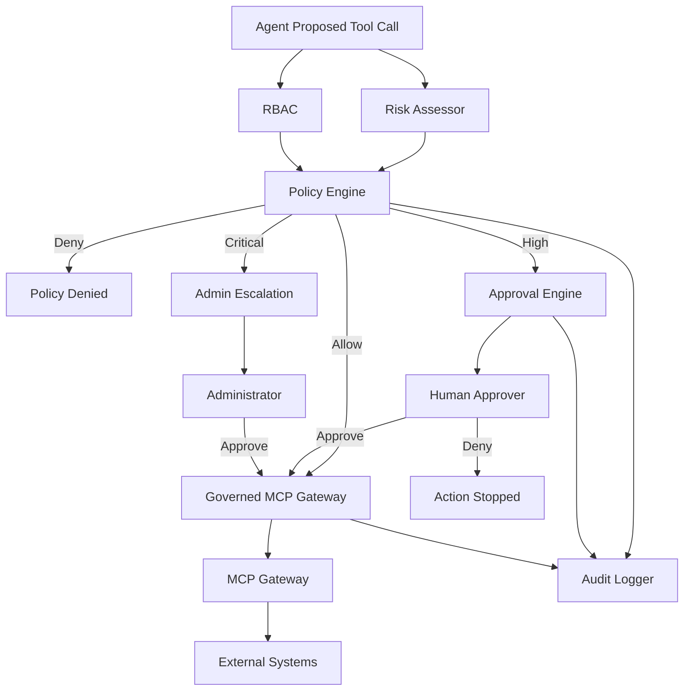
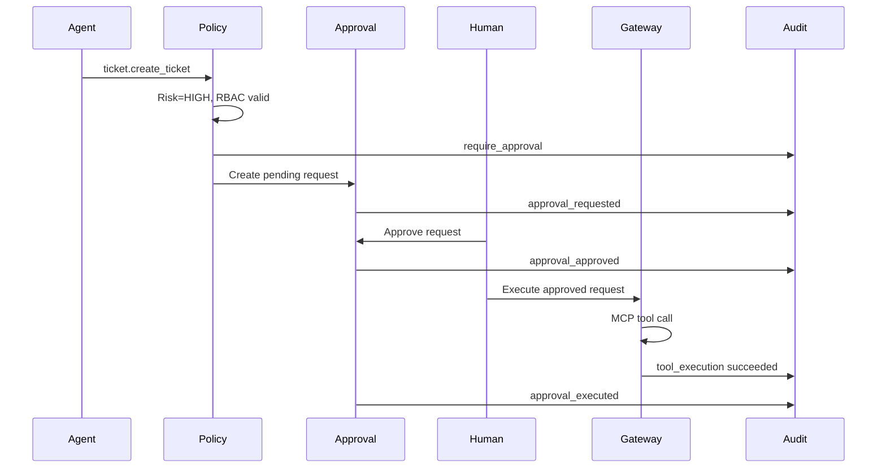

# Phase 10: Human-in-the-Loop Governance

Phase 10 adds enterprise governance controls before agents can execute MCP tools.

```text
Agents
  |
  v
Policy Engine
  |
  v
Approval Engine
  |
  v
MCP Gateway
  |
  v
External Systems
```

## Human-in-the-Loop Systems

Human-in-the-loop systems pause automated actions when human judgment is required.

The agent can still:

- Discover context
- Plan an action
- Explain why it wants the action
- Create an approval request

It cannot perform a high-risk change until an authorized person approves it.

## Governance

Governance defines who and what may perform an action.

This phase evaluates:

1. Which human requested the action?
2. What role does the human have?
3. Which agent is acting?
4. Is the agent allowed to use the tool?
5. What risk level does the action have?
6. Is human approval required?
7. Who may approve it?
8. Was every decision audited?

## RBAC

Role-Based Access Control assigns permissions to roles.

| Role | Capabilities |
|---|---|
| `viewer` | Read-only MCP operations |
| `operator` | Read operations and request write operations |
| `approver` | Operator capabilities plus high-risk approval |
| `admin` | Approver capabilities plus critical approval and policy override |

RBAC applies to human principals.

## Agent-Level Permissions

Agents also have permissions.

Examples:

- `research_agent` can read customer, weather, and ticket status.
- `planning_agent` cannot execute tools.
- `execution_agent` can request ticket creation.
- `reporting_agent` cannot execute tools.
- `autonomous_agent` can use approved operational tools.

Both the human and the agent must be authorized.

## Risk Levels

| Risk | Score | Typical Action |
|---|---:|---|
| `LOW` | 25 | Read customer or weather |
| `MEDIUM` | 50 | Unknown read/moderate operation |
| `HIGH` | 75 | Create or update an external-system record |
| `CRITICAL` | 100 | Deploy, delete, disable, or revoke |

Risk evaluation is deterministic and explainable.

## Policy Outcomes

```text
ALLOW
DENY
REQUIRE_APPROVAL
ESCALATE
```

- Low and medium risk can execute when RBAC permits.
- High risk creates an approval request.
- Critical risk escalates to an administrator.
- Invalid human or agent permissions cause denial.

## Architecture



## High-Risk Approval Flow



## Explainability

Every policy decision includes:

- Outcome
- Risk level
- Risk score
- Human-role reason
- Agent-permission reason
- Tool-risk reason
- Required approval role

Example:

```text
Decision=require_approval; risk=HIGH; score=75.
High-risk external-system changes require human approval.
ticket.create_ticket: Operation changes an external system.
Required approval role: approver.
```

## Separation Of Duties

The requester cannot approve their own action.

Example:

```text
operator-1 requests a ticket
approver-1 approves it
```

This prevents self-approval.

## Audit Logging

Audit records are append-only JSONL.

Recorded actions include:

- `policy_evaluation`
- `approval_requested`
- `approval_approved`
- `approval_denied`
- `tool_execution`
- `approval_executed`

Records include actor, role, agent, tool, outcome, timestamp, arguments, explanation, approval id, result, or failure.

## Setup

```bash
cd /Users/juanitamelosha/Desktop/MCP-build/mcp-poc-python/phase10_governance
python3.12 -m venv .venv
source .venv/bin/activate
python --version
python -m pip install --upgrade pip setuptools wheel
python -m pip install -r requirements.txt
```

`python --version` must show Python 3.12 or newer.

## Examples

### Low-Risk Automatic Execution

```bash
python examples/low_risk_allowed.py
```

The viewer and research agent may read a customer without approval.

### High-Risk Approval

```bash
python examples/high_risk_approval.py
```

This demonstrates:

1. Operator requests ticket creation.
2. Policy pauses execution.
3. Approver approves.
4. Governed gateway executes.
5. Approval becomes `executed`.

### RBAC Denial

```bash
python examples/rbac_denied.py
```

A viewer cannot request ticket creation.

### Agent Permission Denial

```bash
python examples/agent_permission_denied.py
```

Even an admin cannot make the `reporting_agent` execute a ticket tool that the
agent is not permitted to use.

### Critical Escalation

```bash
python examples/critical_escalation.py
```

A production deployment is classified `CRITICAL` and escalated to an admin.

The sample does not execute this fictional tool.

### Audit Records

```bash
python examples/audit_demo.py
```

## Approval Dashboard

The CLI dashboard uses persistent files in `runtime_data/`.

### Create A Pending Request

```bash
python examples/create_dashboard_request.py
```

Copy the printed request id.

### List Requests

```bash
python approval_dashboard.py list
python approval_dashboard.py list --status pending
```

### Show A Request

```bash
python approval_dashboard.py show REQUEST_ID
```

### Approve

```bash
python approval_dashboard.py approve REQUEST_ID \
  --actor approver-1 \
  --role approver \
  --reason "Validated customer support request"
```

### Deny

```bash
python approval_dashboard.py deny REQUEST_ID \
  --actor approver-1 \
  --role approver \
  --reason "Insufficient business justification"
```

### Execute An Approved Request

```bash
python approval_dashboard.py execute REQUEST_ID \
  --actor approver-1 \
  --role approver
```

### Read Audit Logs

```bash
python approval_dashboard.py audit
```

## Every File

### `governance/risk_assessor.py`

Risk levels, scoring, sensitive-data checks, and conservative unknown-tool classification.

### `governance/rbac.py`

Human roles, role permissions, and agent tool permissions.

### `governance/policy_engine.py`

Combines risk, RBAC, and agent permissions into explainable decisions.

### `governance/approval_engine.py`

Persists approval requests and enforces approval permissions and separation of duties.

### `governance/audit_logger.py`

Writes and queries append-only audit records.

### `gateway.py`

Raw Phase 3 MCP gateway. It is placed behind governance.

### `governed_gateway.py`

The mandatory governance boundary before MCP execution.

### `governance_platform.py`

Builds all governance components.

### `approval_dashboard.py`

CLI for listing, inspecting, approving, denying, executing, and auditing requests.

### `examples/low_risk_allowed.py`

Read-only automatic execution.

### `examples/high_risk_approval.py`

Complete approval workflow.

### `examples/rbac_denied.py`

Human-role denial.

### `examples/agent_permission_denied.py`

Agent-level permission denial.

### `examples/critical_escalation.py`

Critical admin escalation.

### `examples/audit_demo.py`

Audit-log inspection.

### `examples/create_dashboard_request.py`

Creates a persistent request for CLI use.

## Every Class

### `RiskLevel`

Ordered risk enum: LOW, MEDIUM, HIGH, CRITICAL.

### `RiskAssessment`

Risk level, numeric score, and reasons.

### `RiskAssessor`

Classifies proposed MCP actions.

### `Role`

Human RBAC roles.

### `Principal`

Authenticated human id and role.

### `RBAC`

Checks human and agent permissions.

### `DecisionType`

Allow, deny, require approval, or escalate.

### `PolicyDecision`

Explainable governance outcome.

### `PolicyEngine`

Evaluates all policy inputs.

### `AuditRecord`

Immutable audit event.

### `AuditLogger`

Append-only audit store.

### `ApprovalStatus`

Pending, approved, denied, or executed.

### `ApprovalRequest`

Persisted action and human decision.

### `ApprovalEngine`

Creates and decides requests.

### `MCPGateway`

Executes MCP tools after governance.

### `GovernedResult`

Executed result plus its policy decision and approval id.

### `ApprovalRequired`

Signals that execution is paused.

### `PolicyDenied`

Signals that policy rejected the request.

### `GovernedMCPGateway`

Policy-enforced MCP execution boundary.

### `GovernancePlatform`

Container for the complete system.

## Every Important Function

### Risk

- `assess()`: classifies a tool call.
- `_infer_unknown_tool_risk()`: conservatively classifies unknown tools.
- `_contains_sensitive_data()`: detects sensitive argument fields.

### RBAC

- `has_permission()`: checks a human permission.
- `agent_can_use()`: checks an agent tool permission.
- `explain_role()`: lists role permissions.
- `explain_agent()`: lists agent permissions.

### Policy

- `evaluate()`: returns allow, deny, approval, or escalation.
- `explanation()`: formats the decision reasoning.

### Approval

- `create()`: creates a pending request.
- `list_requests()`: lists requests.
- `get()`: reads a request.
- `approve()`: approves with RBAC and separation of duties.
- `deny()`: denies a request.
- `mark_executed()`: closes an executed request.

### Audit

- `log()`: appends a record.
- `records()`: reads records.
- `search()`: filters records.

### Governed Gateway

- `request_tool()`: evaluates and executes or pauses an action.
- `execute_approved()`: resumes an approved action.
- `_execute()`: performs and audits the MCP call.
- `_audit_decision()`: audits explainability data.

### Dashboard

- `build_parser()`: defines CLI commands.
- `run()`: runs one dashboard operation.
- `main()`: CLI entry point.

## Enterprise Evolution

Production systems typically add:

- Identity-provider integration
- SSO and MFA
- Directory-backed roles
- Attribute-based access control
- Policy-as-code engines such as OPA
- Time-limited approvals
- Multi-party approval
- Approval notifications
- Cryptographically protected audit logs
- Data-loss prevention
- Tenant isolation
- Regional controls
- Compliance retention
- Emergency break-glass access
- Human review queues

The core boundary remains:

```text
No agent reaches an external system without passing governance.
```
