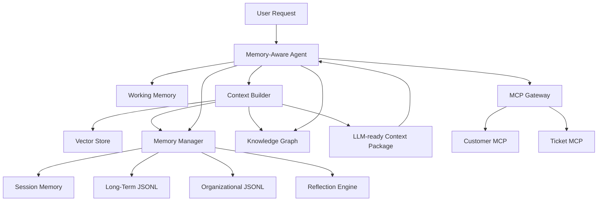
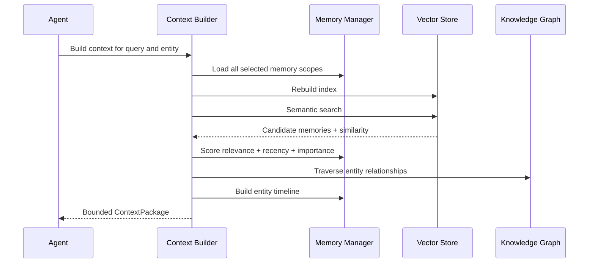
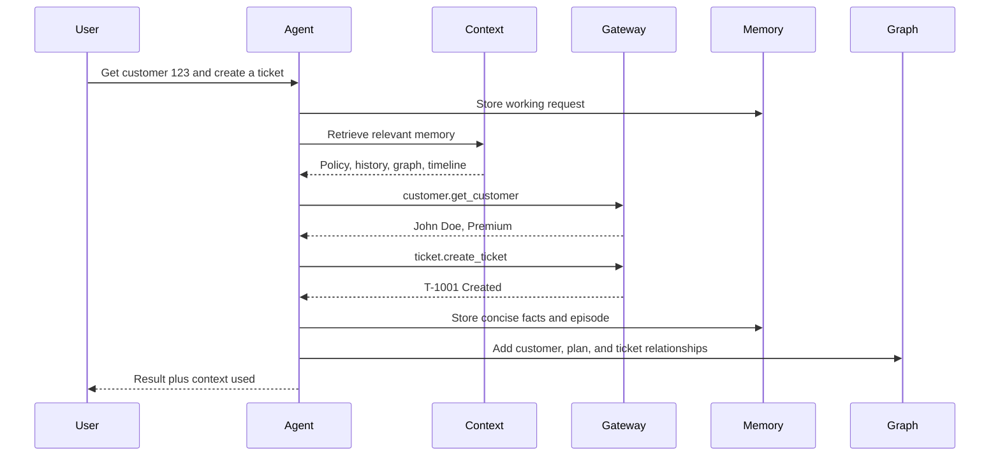

# Phase 11: Agent Memory, RAG, and Knowledge

Phase 11 gives MCP-aware agents memory and organizational knowledge.

```text
Agents
  |
  v
Memory Layer
  |
  v
Context Builder
  |
  v
LLM-ready Context
```

No external LLM, vector database, or graph database is required. The learning lab uses deterministic local embeddings, JSONL persistence, and a small property graph.

## Memory Types

### Working Memory

Short-lived information needed for the current task.

Examples:

- Current user request
- Intermediate calculations
- Current tool arguments

Working memory is cleared after the task.

### Session Memory

Information remembered during the current conversation or process.

Examples:

- Recently completed workflow
- Current conversation preferences
- Recent tool outcomes

Session memory disappears when the process ends unless promoted.

### Long-Term Memory

Durable knowledge learned from previous interactions.

Examples:

- Customer profile facts
- Previous support tickets
- Repeated workflow outcomes
- Reflections

This phase stores long-term memory in append-only JSONL.

### Organizational Memory

Knowledge shared by all authorized agents.

Examples:

- Company policy
- Security rules
- Support playbooks
- Product terminology
- Reviewed lessons

Organizational memory uses a separate shared JSONL file.

## RAG

RAG means Retrieval-Augmented Generation.

Before asking an LLM to answer, the system:

1. Converts the request into an embedding.
2. Finds semantically relevant memory.
3. Retrieves graph relationships.
4. Constructs an entity timeline.
5. Scores and limits context.
6. Supplies the assembled context to the model.

This phase stops at an **LLM-ready context package**. It does not require an LLM API.

## Vector Search

Vector search compares embeddings using cosine similarity.

This lab uses local feature hashing:

- Tokenize text.
- Create word and adjacent-word features.
- Hash features into 256 dimensions.
- Normalize the vector.
- Compare vectors using cosine similarity.

It is deterministic, private, and easy to inspect.

Production systems commonly use embedding models and vector databases such as pgvector, Pinecone, Weaviate, Qdrant, Milvus, OpenSearch, or managed cloud search.

## Embeddings

An embedding is a numeric representation of meaning.

Similar text should have vectors pointing in similar directions.

Example:

```text
premium customer support
high-priority support plan
```

These should have higher similarity than unrelated weather text.

The local embedding is educational, not equivalent to a neural embedding model.

## Knowledge Graphs

A knowledge graph represents entities and relationships.

Example:

```text
customer:123 --SUBSCRIBED_TO--> plan:premium
customer:123 --HAS_TICKET--> ticket:T-1001
```

Vector search answers:

```text
Which text is semantically relevant?
```

Knowledge graphs answer:

```text
How are these entities explicitly connected?
```

The two approaches complement each other.

## Context Engineering

Context engineering decides what information reaches an agent or LLM.

Good context should be:

- Relevant
- Recent
- Important
- Structured
- Bounded
- Clearly labeled
- Free from recursive or duplicated content

The context builder creates:

```text
QUERY
RELEVANT MEMORIES
KNOWLEDGE GRAPH
TIMELINE
```

## Long-Term Memory

Long-term memory should not store every raw prompt and response forever.

This phase stores concise facts and episode summaries:

```text
Customer 123 is John Doe on the Premium plan.
Ticket T-1001 was created for customer 123.
```

Concise memories produce better future retrieval than recursively storing complete rendered context.

## Architecture



## Retrieval Pipeline



## Memory Scoring

The final score is:

```text
60% semantic relevance
20% recency
20% importance
```

Recency uses a 30-day exponential decay.

Importance is supplied when the memory is written:

```text
0.5 routine fact
0.8 important customer context
0.9 important policy or ticket outcome
1.0 critical durable lesson
```

## Reflection

Reflection turns repeated experiences into durable lessons.

Example evidence:

```text
premium_login_issue -> ticket_created
premium_login_issue -> ticket_created
premium_login_issue -> resolved_without_ticket
```

Generated reflection:

```text
Repeated pattern 'premium_login_issue' occurred 3 times;
most common outcome was 'ticket_created'.
```

The reflection is stored in long-term memory with evidence ids and confidence.

Reviewed reflections can be promoted to organizational memory.

## Timeline Construction

Timelines sort memory chronologically and can filter by entity:

```text
Customer joined Premium plan
Customer reported login issue
Ticket T-1001 was created
```

Timelines help project-management, support, incident, and sprint agents understand sequence.

## MCP-Aware Agent Flow



## Setup

```bash
cd /Users/juanitamelosha/Desktop/MCP-build/mcp-poc-python/phase11_memory_knowledge
python3.12 -m venv .venv
source .venv/bin/activate
python --version
python -m pip install --upgrade pip setuptools wheel
python -m pip install -r requirements.txt
```

`python --version` must show Python 3.12 or newer.

## Run Examples

### Semantic Vector Search

```bash
python examples/vector_search_demo.py
```

Expected ordering begins with the most relevant support policy.

### Knowledge Graph

```bash
python examples/knowledge_graph_demo.py
```

Expected:

```text
customer:123 --SUBSCRIBED_TO--> plan:premium
customer:123 --HAS_TICKET--> ticket:T-1001
```

### Dynamic Context

```bash
python examples/context_builder_demo.py
```

Prints relevant memories, graph facts, and timeline.

### Memory-Aware MCP Agent

```bash
python examples/memory_aware_agent.py
```

The first request creates durable customer/ticket knowledge. The second request retrieves that accumulated memory.

### Reflection

```bash
python examples/reflection_demo.py
```

### Timeline

```bash
python examples/timeline_demo.py
```

## Every File

### `memory/memory_manager.py`

Memory types, records, persistence, scoring, promotion, and timelines.

### `memory/vector_store.py`

Local embeddings, vector indexing, cosine similarity, and semantic retrieval.

### `memory/knowledge_graph.py`

Entities, relationships, graph queries, traversal, and JSON persistence.

### `memory/context_builder.py`

Retrieval pipeline, rescoring, graph retrieval, timelines, and rendered context.

### `memory/reflection_engine.py`

Pattern detection, reflections, and organizational lesson publication.

### `agents/memory_agent.py`

Memory-aware MCP customer-support agent.

### `gateway.py`

Routes the agent to Phase 3 MCP tools.

### `memory_platform.py`

Builds and connects all memory components.

### `examples/common.py`

Temporary platform creation and sample organizational-memory seeding.

### `examples/vector_search_demo.py`

Semantic organizational-memory retrieval.

### `examples/knowledge_graph_demo.py`

Graph creation and traversal.

### `examples/context_builder_demo.py`

Full dynamic context assembly.

### `examples/memory_aware_agent.py`

Two-turn memory-aware MCP workflow.

### `examples/reflection_demo.py`

Repeated-experience reflection.

### `examples/timeline_demo.py`

Chronological entity history.

## Every Class

### `MemoryType`

Working, session, long-term, and organizational scopes.

### `MemoryRecord`

Content, source, type, importance, metadata, timestamps, and access data.

### `ScoredMemory`

Final score plus semantic, recency, and importance components.

### `MemoryManager`

Owns all memory scopes and persistence.

### `VectorSearchResult`

Memory plus cosine similarity.

### `LocalEmbeddingModel`

Deterministic feature-hashing embedding.

### `VectorStore`

Local vector index and search.

### `Entity`

Graph node with type and properties.

### `Relationship`

Directed graph edge.

### `GraphFact`

Readable entity-relationship-entity result.

### `KnowledgeGraph`

Persistent property graph.

### `ContextPackage`

Query, scored memories, graph facts, timeline, and rendered context.

### `ContextBuilder`

Orchestrates memory retrieval and context construction.

### `Reflection`

Lesson, evidence ids, confidence, and metadata.

### `ReflectionEngine`

Generates durable lessons from repeated experiences.

### `AgentResponse`

Agent result and context used.

### `MemoryAwareSupportAgent`

Retrieves memory, invokes MCP, and stores new knowledge.

### `MemoryPlatform`

Container for all memory-aware components.

## Every Important Function

### Memory Manager

- `remember()`: stores memory in a selected scope.
- `all_memories()`: loads selected scopes.
- `score()`: combines relevance, recency, and importance.
- `build_timeline()`: constructs chronological entity history.
- `promote_session_memory()`: promotes important episodes.
- `clear_working()`: removes task memory.
- `clear_session()`: ends the current session.

### Vector Store

- `embed()`: converts text to a vector.
- `index()`: indexes one memory.
- `index_many()`: indexes many memories.
- `search()`: returns semantic matches.
- `remove()`: removes one vector.
- `clear()`: rebuild support for ephemeral memory.
- `count()`: reports index size.

### Knowledge Graph

- `upsert_entity()`: creates or updates a node.
- `add_relationship()`: creates an edge.
- `neighbors()`: queries direct facts.
- `related()`: traverses multiple graph levels.
- `find_entities()`: filters entities.
- `save()`: persists the graph.
- `load()`: loads the graph.

### Context Builder

- `refresh_index()`: rebuilds vectors from current memory.
- `build()`: runs the complete retrieval pipeline.
- `organizational_context()`: retrieves shared organizational knowledge.
- `_render()`: creates labeled LLM-ready context.

### Reflection

- `reflect()`: derives repeated-pattern lessons.
- `create_organizational_lesson()`: publishes reviewed shared knowledge.

### Agent

- `handle()`: retrieves context, calls MCP, updates memory and graph.
- `_remember_customer()`: stores customer facts.
- `_remember_ticket()`: stores ticket facts.
- `_extract_customer_id()`: extracts the target customer.
- `_choose_priority()`: applies retrieved organizational policy before fallback logic.

## Evolution

### Virtual Project Manager

Memory stores:

- Project goals
- Decisions
- Risks
- Stakeholder preferences
- Milestone history

The graph connects projects, people, Jira issues, repositories, and dependencies.

### PAXI

A personal or organizational AI assistant can use:

- Session memory for current conversations
- Long-term memory for preferences and history
- Organizational memory for policies
- Graph relationships for people, teams, systems, and work
- Reflection to improve recurring workflows

### Friday Rewind

The timeline collects the week's GitHub, Jira, Slack, and calendar events.

RAG retrieves important accomplishments and blockers. Reflection identifies repeated themes. The report agent creates a concise weekly rewind.

### Sprint Intelligence

Memory and graphs can answer:

- Which issues repeatedly block this team?
- Which services are connected to delayed work?
- What changed since the previous sprint?
- Which decisions caused scope growth?
- Which risks recur across projects?

### Enterprise Knowledge Agents

Production evolution adds:

- Neural embedding models
- Vector databases
- Graph databases such as Neo4j
- Access-controlled retrieval
- Tenant isolation
- Data lineage
- Source citations
- Retention and deletion policies
- PII detection
- Memory approval and correction
- Contradiction handling
- Temporal graph queries
- Evaluation for retrieval quality

The central rule remains:

```text
Retrieve only the minimum relevant, authorized, trustworthy context needed for the task.
```
