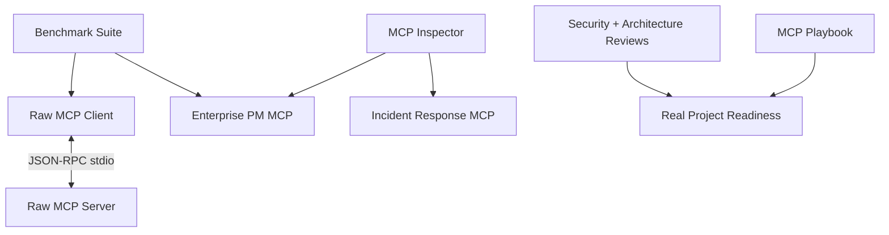
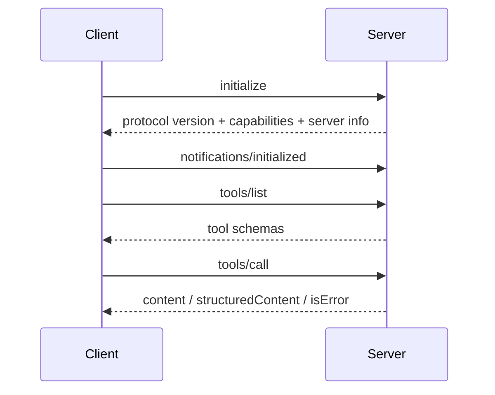

# Phase 12: MCP Mastery Graduation

This is the final MCP learning-lab phase.

It introduces no major platform concept. It consolidates, validates, benchmarks, reviews, and demonstrates the knowledge from Phases 1-11.

## Graduation Architecture



## MCP Protocol Internals

MCP uses JSON-RPC 2.0 messages.

### Request

```json
{
  "jsonrpc": "2.0",
  "id": 1,
  "method": "tools/list",
  "params": {}
}
```

### Success

```json
{
  "jsonrpc": "2.0",
  "id": 1,
  "result": {
    "tools": []
  }
}
```

### Error

```json
{
  "jsonrpc": "2.0",
  "id": 1,
  "error": {
    "code": -32601,
    "message": "Method not found"
  }
}
```

### Notification

Notifications have no `id` and receive no response:

```json
{
  "jsonrpc": "2.0",
  "method": "notifications/initialized"
}
```

## Lifecycle



Key rules:

1. `initialize` is the first interaction.
2. Client and server negotiate a protocol version.
3. Capabilities declare supported features.
4. Client sends `notifications/initialized`.
5. Normal operations begin only after initialization.

## JSON-RPC Errors vs Tool Errors

JSON-RPC errors mean the request or protocol operation failed:

```text
Unknown method
Invalid parameters
Server not initialized
```

Tool errors are successful `tools/call` protocol responses with:

```json
{
  "isError": true,
  "content": [
    {
      "type": "text",
      "text": "Business operation failed"
    }
  ]
}
```

This distinction lets models receive actionable tool errors without treating the MCP session as broken.

## Project Structure

```text
phase12_mcp_mastery/
├── raw/
│   ├── raw_client.py
│   └── raw_server.py
├── inspector/
│   └── mcp_inspector.py
├── enterprise_pm/
│   └── server.py
├── benchmarks/
│   └── benchmark_suite.py
├── graduation_challenge/
│   ├── server.py
│   └── verify.py
├── examples/
│   └── inspect_enterprise_pm.py
├── docs/
│   ├── architecture_review.md
│   ├── benchmarks.md
│   ├── graduation_challenge.md
│   ├── playbook.md
│   ├── security_review.md
│   ├── transports.md
│   └── troubleshooting.md
├── requirements.txt
└── README.md
```

## Setup

```bash
cd /Users/juanitamelosha/Desktop/MCP-build/mcp-poc-python/phase12_mcp_mastery
python3.12 -m venv .venv
source .venv/bin/activate
python --version
python -m pip install --upgrade pip setuptools wheel
python -m pip install -r requirements.txt
```

`python --version` must show Python 3.12 or newer.

## 1. Raw MCP Server

File:

[raw/raw_server.py](raw/raw_server.py)

### Concept

A raw MCP server exposes the protocol without SDK abstractions.

### Why It Exists

It teaches:

- Newline framing
- JSON-RPC ids
- Requests vs notifications
- Initialization state
- Capability negotiation
- Tool discovery
- Tool execution
- Protocol and tool errors

### Implementation

The server reads one JSON object per stdin line and writes one JSON object per stdout line.

Supported methods:

```text
initialize
notifications/initialized
ping
tools/list
tools/call
```

Tools:

```text
echo
add
```

Run directly:

```bash
python raw/raw_server.py
```

It waits silently because it expects JSON-RPC on stdin.

### Production Considerations

Use the official SDK in production unless protocol-level customization is necessary. A full implementation must handle:

- All negotiated capabilities
- Pagination
- Cancellation
- Progress
- Logging
- Sampling and elicitation where supported
- Resource templates and subscriptions
- Prompt operations
- Robust schema validation
- Concurrent requests

## 2. Raw MCP Client

File:

[raw/raw_client.py](raw/raw_client.py)

### Concept

The raw client owns server startup, request ids, lifecycle order, and response matching.

### Why It Exists

It proves you understand what `ClientSession` normally does.

### Run

```bash
python raw/raw_client.py
```

It prints:

- Initialize response
- Tool discovery
- Tool results
- Complete raw JSON-RPC transcript

### Production Considerations

- Dispatch responses by id rather than blocking one request at a time.
- Handle notifications and server requests concurrently.
- Add timeouts and cancellation.
- Enforce output-size limits.
- Handle subprocess termination and stderr.

## 3. MCP Inspector

File:

[inspector/mcp_inspector.py](inspector/mcp_inspector.py)

### Concept

An Inspector reveals what a server actually negotiates and exposes.

### Why It Exists

MCP failures are often lifecycle, schema, transport, or capability problems. The Inspector gives a repeatable diagnostic surface.

### Features

- stdio
- Streamable HTTP
- Legacy SSE compatibility
- Initialization metadata
- Tool/resource/prompt discovery
- JSON Schema validation
- Tool calls
- Resource reads
- Operation timing
- Rich or JSON output

### Inspect Enterprise PM

```bash
python inspector/mcp_inspector.py \
  --transport stdio \
  --command python \
  --arg enterprise_pm/server.py \
  --arg stdio
```

Call a tool:

```bash
python inspector/mcp_inspector.py \
  --transport stdio \
  --command python \
  --arg enterprise_pm/server.py \
  --arg stdio \
  --call-tool get_project \
  --arguments '{"project_id":"P-100"}'
```

Or:

```bash
python examples/inspect_enterprise_pm.py
```

### Production Considerations

- Redact credentials and sensitive payloads.
- Add protocol message capture with opt-in controls.
- Add pagination and notification monitoring.
- Add TLS/auth diagnostics.
- Export machine-readable reports for CI.

## 4. Transport Comparison

Read:

[docs/transports.md](docs/transports.md)

Summary:

- `stdio`: current standard for local process integrations.
- Streamable HTTP: current standard for remote/network integrations.
- Legacy HTTP+SSE: deprecated compatibility transport.

The enterprise and challenge servers support all three modes for learning:

```bash
python enterprise_pm/server.py stdio
python enterprise_pm/server.py http
python enterprise_pm/server.py sse
```

## 5. Enterprise Project Management MCP

File:

[enterprise_pm/server.py](enterprise_pm/server.py)

### Concept

A domain MCP server groups capabilities owned by one bounded business domain.

### Why It Exists

It demonstrates a realistic server beyond toy tools.

### Tools

```text
list_projects
get_project
create_work_item
update_work_item_status
list_sprint_items
project_status_report
```

### Resources

```text
pm://handbook
pm://roadmap
```

### Prompts

```text
sprint_planning_template
executive_status_template
```

### Production Considerations

Replace in-memory dictionaries with domain services. Add:

- Identity and authorization
- Optimistic concurrency
- Idempotency
- Data validation
- Audit logs
- Pagination
- Database transactions
- Tenant boundaries

## 6. Benchmark Suite

File:

[benchmarks/benchmark_suite.py](benchmarks/benchmark_suite.py)

Run:

```bash
python benchmarks/benchmark_suite.py --iterations 20
```

It compares:

- Raw stdio initialization
- Raw stdio discovery
- Raw stdio calls
- SDK stdio initialization
- SDK stdio discovery
- SDK stdio calls

Read:

[docs/benchmarks.md](docs/benchmarks.md)

### Production Considerations

Laptop microbenchmarks are diagnostic, not capacity guarantees. Add concurrency, remote TLS, realistic external dependencies, resource monitoring, and error rates.

## 7. Security Review

Read:

[docs/security_review.md](docs/security_review.md)

It covers:

- Authentication
- Authorization
- Tool risk
- Prompt injection
- stdio command safety
- HTTP Origin and DNS rebinding
- SSRF
- logging
- supply chain
- production release gates

## 8. Architecture Review

Read:

[docs/architecture_review.md](docs/architecture_review.md)

It reviews all 12 phases, identifies the strongest patterns, and defines what should be consolidated before starting a real codebase.

## 9. MCP Playbook

Read:

[docs/playbook.md](docs/playbook.md)

It is the reusable checklist for:

- Discovery
- Server design
- Client design
- Gateway design
- Security
- Operations
- Reviews
- Graduation questions

## 10. Troubleshooting

Read:

[docs/troubleshooting.md](docs/troubleshooting.md)

It covers stdio hangs, stdout corruption, lifecycle errors, protocol mismatches, missing tools, schema failures, HTTP statuses, sessions, and SSE compatibility.

## 11. Graduation Challenge

Reference solution:

[graduation_challenge/server.py](graduation_challenge/server.py)

Challenge guide:

[docs/graduation_challenge.md](docs/graduation_challenge.md)

Verify:

```bash
python graduation_challenge/verify.py
```

The new Incident Response MCP includes:

- Four tools
- One resource
- One prompt
- stdio
- Streamable HTTP
- Legacy SSE compatibility
- Inspector-based verification

## Every Important Class

### `RawTool`

Raw server tool name, description, schema, and handler.

### `RawMCPServer`

Direct JSON-RPC stdio server.

### `RawMCPClient`

Direct JSON-RPC stdio client and transcript recorder.

### `Transport`

Inspector transport selection.

### `InspectorConfig`

Inspector connection settings.

### `Timing`

Measured inspector operation.

### `MCPInspector`

SDK-backed server diagnostic tool.

### `WorkItem`

Typed enterprise project-management work item.

### `BenchmarkResult`

Benchmark statistics and notes.

## Every Important Function

### Raw Server

- `run()`: reads framed messages.
- `handle()`: dispatches protocol methods.
- `initialize()`: negotiates lifecycle.
- `list_tools()`: returns schemas.
- `call_tool()`: executes raw tools.
- `success()`: creates JSON-RPC success.
- `error()`: creates JSON-RPC error.
- `write()`: flushes one protocol line.

### Raw Client

- `connect()`: launches and initializes.
- `disconnect()`: closes the process.
- `request()`: sends request and matches id.
- `notify()`: sends notification.
- `list_tools()`: discovers tools.
- `call_tool()`: invokes tools.

### Inspector

- `connect()`: opens the selected transport.
- `inspect()`: discovers and validates.
- `call_tool()`: invokes while timing.
- `read_resource()`: reads while timing.
- `render_report()`: displays Rich diagnostics.

### Enterprise PM

- `list_projects()`: lists projects.
- `get_project()`: reads a project.
- `create_work_item()`: creates work.
- `update_work_item_status()`: updates status.
- `list_sprint_items()`: lists sprint work.
- `project_status_report()`: aggregates health.
- Resource functions return domain context.
- Prompt functions return reusable workflows.

### Benchmarks

- `summarize()`: calculates latency statistics.
- `benchmark_raw()`: measures raw stdio.
- `benchmark_sdk()`: measures SDK stdio.

## Official References

- MCP lifecycle: https://modelcontextprotocol.io/specification/2025-06-18/basic/lifecycle
- MCP transports: https://modelcontextprotocol.io/specification/2025-06-18/basic/transports
- MCP tools: https://modelcontextprotocol.io/specification/2025-06-18/server/tools
- MCP resources: https://modelcontextprotocol.io/specification/2025-06-18/server/resources
- MCP prompts: https://modelcontextprotocol.io/specification/2025-06-18/server/prompts
- Python SDK: https://github.com/modelcontextprotocol/python-sdk

## Graduation Checklist

You are ready to leave the learning lab when you can:

- Explain initialization and capability negotiation.
- Distinguish requests, responses, errors, and notifications.
- Explain JSON-RPC errors versus tool errors.
- Build a raw client and server.
- Build an SDK client and server.
- Inspect and debug discovery.
- Choose stdio or Streamable HTTP.
- Explain legacy SSE compatibility.
- Design tools, resources, and prompts.
- Build a multi-server gateway.
- Add OAuth and authorization.
- Apply governance and approval.
- Add events, memory, and agents without breaking MCP boundaries.
- Define security, observability, reliability, and production architecture.

At this point, stop adding learning phases.

Choose a real business workflow, define its users and risks, and build the smallest production-quality MCP-powered vertical slice.

