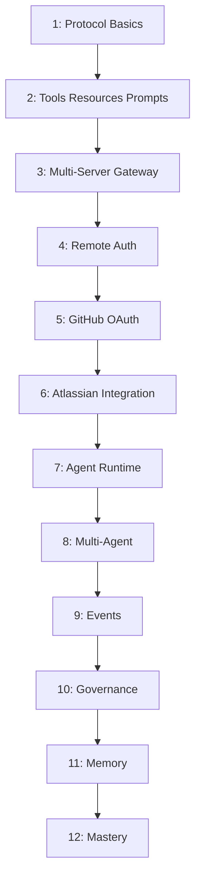
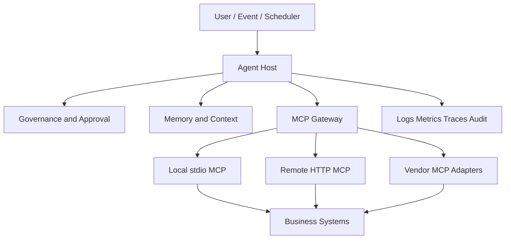

# Architecture Review

## Learning Journey



## Reference Architecture



## Strong Patterns

- Separate host, client, server, and gateway responsibilities.
- Discover capabilities rather than hard-code availability.
- Namespace multi-server tools.
- Keep vendor OAuth inside adapters.
- Place governance before execution.
- Treat memory retrieval as an authorized context operation.
- Use events for autonomous triggers.
- Preserve correlation and audit data.

## Refactoring Before A Real Project

The learning phases intentionally duplicate gateway and connection code. A real project should consolidate:

```text
src/
  mcp_platform/
    clients/
    gateway/
    providers/
    governance/
    memory/
    agents/
    events/
```

Recommended boundaries:

- `TransportFactory`: stdio, HTTP, legacy SSE.
- `MCPConnection`: lifecycle and retries.
- `ProviderAdapter`: vendor auth and endpoint behavior.
- `ToolCatalog`: discovery, schemas, namespacing, caching.
- `GovernedExecutor`: authorization and approvals.
- `AgentRuntime`: planning and execution.
- `MemoryService`: retrieval and persistence.
- `EventRuntime`: triggers, retries, replay.

## Scalability

Local prototype:

- In-process queues
- JSONL data
- One Python process
- Child-process MCP servers

Production:

- Durable event broker
- Relational/vector/graph stores
- Distributed workers
- Central secret manager
- Policy engine
- OpenTelemetry
- Load-balanced Streamable HTTP servers

## Reliability

Add:

- Timeouts for every request
- Bounded retries
- Circuit breakers
- Bulkheads by server
- Idempotency keys
- Health checks
- Session reinitialization
- Dead-letter queues
- Graceful shutdown

## Readiness Decision

You are ready for a real project when you can:

- Draw the lifecycle from memory.
- Explain capability negotiation.
- Read raw JSON-RPC traffic.
- Identify transport-specific failures.
- Build and inspect a new server.
- Define auth and authorization boundaries.
- Choose gateway ownership.
- Set tool-risk and approval policy.
- Define observability and reliability requirements.

