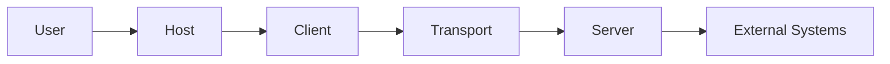

# Security Review

## Threat Model

Assets:

- MCP credentials and OAuth tokens
- Tool capabilities
- Resources and organizational data
- Prompt templates
- User identity and authorization context
- Server executable paths
- Audit logs

Trust boundaries:

## Findings Checklist

### Authentication

- Remote MCP servers require authentication.
- Tokens must come from secret storage, not source code.
- Access tokens must be scoped, expiring, and refreshable where supported.
- Token audience and issuer must be validated.

### Authorization

- Authentication alone is insufficient.
- Enforce user roles, agent permissions, tool scopes, and resource ownership.
- High-risk tools require confirmation or approval.
- Treat server-provided tool annotations as untrusted metadata.

### Tool Safety

- Validate all arguments against schemas.
- Apply business validation after schema validation.
- Classify tools by side effects.
- Make write operations idempotent when possible.
- Add dry-run modes for destructive operations.
- Require human approval for high-impact changes.

### Prompt Injection

- Resources and tool results can contain malicious instructions.
- Keep retrieved data separate from system/developer instructions.
- Label source and trust level.
- Do not let resource text grant new tool permissions.
- Limit chained autonomous actions.

### stdio

- Allowlist commands and arguments.
- Do not execute user-supplied command strings.
- Avoid passing unnecessary secrets in environment variables.
- Ensure protocol output is isolated to stdout.
- Apply process CPU, memory, and time limits.

### Streamable HTTP

- Validate `Origin` to mitigate DNS rebinding.
- Bind local services to localhost.
- Use HTTPS remotely.
- Implement authentication and rate limiting.
- Validate `MCP-Protocol-Version`.
- Protect session identifiers.
- Set body-size limits.

### SSRF And Resources

- Do not allow arbitrary user-provided URLs without validation.
- Restrict schemes and hosts.
- Block cloud metadata and internal network ranges.
- Limit resource sizes and content types.

### Logging

- Never log tokens, secrets, passwords, or full sensitive payloads.
- Add correlation ids.
- Protect log integrity and retention.
- Record policy decisions and approvals.

### Supply Chain

- Pin dependency ranges and generate lock files.
- Verify package sources.
- Scan dependencies and containers.
- Review server executable provenance.

## Review Of This Graduation Lab

Strengths:

- Raw protocol code validates lifecycle order.
- Inspector validates JSON schemas.
- stdio logs remain separate.
- Enterprise server uses typed arguments.
- Earlier phases demonstrate OAuth, RBAC, approval, and audit controls.

Intentional learning-lab limitations:

- Data stores are in memory or local files.
- No production identity provider.
- No distributed rate limiting.
- No mTLS or production TLS termination.
- No container/resource sandbox.
- No durable queue or database.

## Production Release Gate

Before production:

1. Complete threat modeling.
2. Assign tool risk levels.
3. Configure least-privilege auth.
4. Add policy and approval gates.
5. Add schema and business validation.
6. Add timeouts, retries, and idempotency.
7. Add structured audit logging.
8. Pen-test remote transports.
9. Test prompt-injection boundaries.
10. Define incident response and credential rotation.

