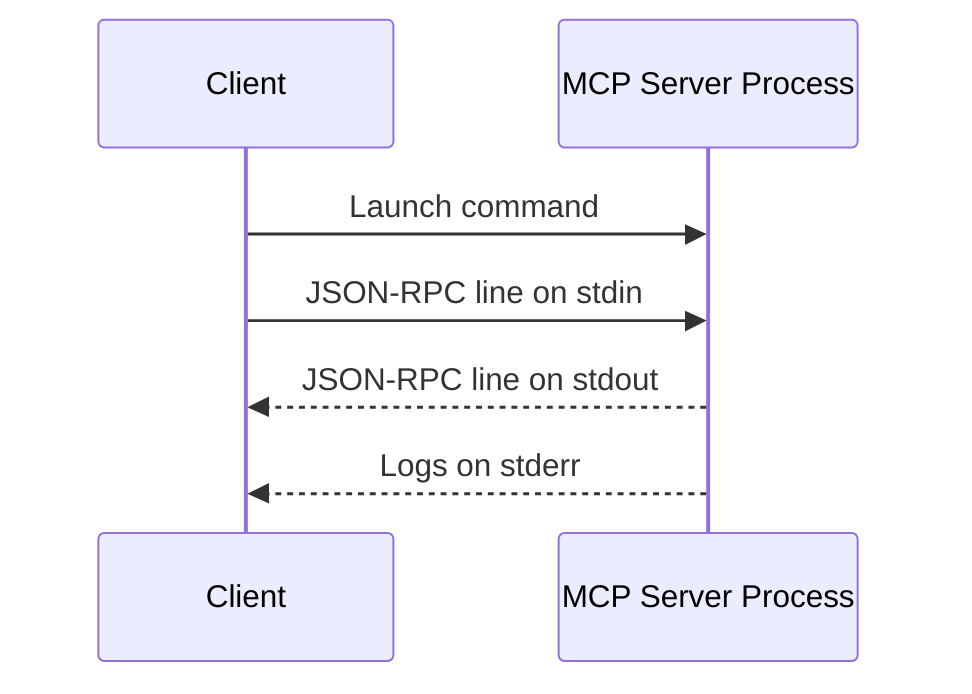
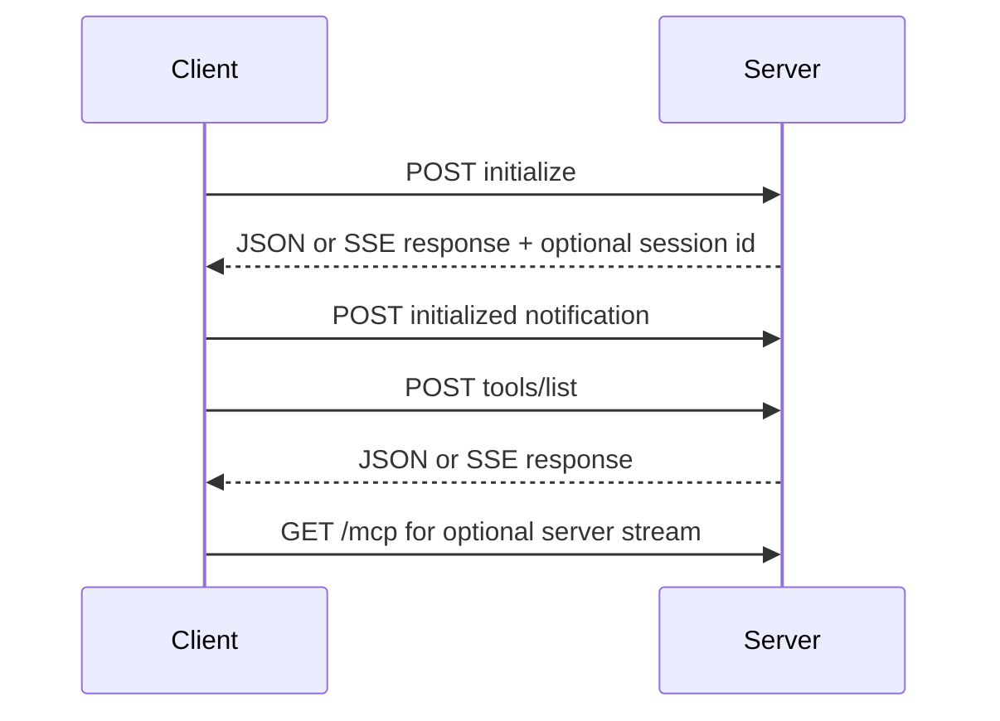

# MCP Transport Comparison

## Current Standard

The MCP specification dated June 18, 2025 defines two standard transports:

1. `stdio`
2. Streamable HTTP

Legacy HTTP+SSE comes from protocol version `2024-11-05`. It remains important for compatibility but has been replaced by Streamable HTTP.

## Comparison

| Concern | stdio | Streamable HTTP | Legacy SSE |
|---|---|---|---|
| Deployment | Client launches child process | Independent remote/local service | Independent service with separate stream/message behavior |
| Standard status | Current | Current | Deprecated compatibility |
| Network | None required | Required | Required |
| Authentication | Usually process/user boundary | OAuth, bearer, API keys, mTLS | Same HTTP auth patterns |
| Scaling | One process per connection/integration | Load balancers and multiple clients | Possible but operationally more complex |
| Streaming | Bidirectional process streams | JSON responses or SSE streams | SSE event stream |
| Session support | Process lifetime | Optional `Mcp-Session-Id` | Legacy endpoint/session patterns |
| Best use | Local tools, IDEs, desktop apps | Vendor and enterprise MCP services | Existing older MCP servers |
| Main risks | stdout corruption, subprocess trust | auth, Origin validation, DNS rebinding, exposure | same HTTP risks plus legacy complexity |

## stdio Internals



Rules:

- Messages are UTF-8 JSON-RPC.
- Each message is one line.
- Messages cannot contain embedded newlines.
- Server logs belong on `stderr`.
- Non-protocol output on `stdout` corrupts the connection.

Production considerations:

- Allowlist executable commands.
- Sanitize environment variables.
- Set timeouts.
- Limit subprocess resources.
- Capture stderr separately.
- Shut down with close, terminate, then kill escalation.

## Streamable HTTP Internals



Important headers:

```text
Accept: application/json, text/event-stream
MCP-Protocol-Version: negotiated-version
Mcp-Session-Id: optional server-issued session
Authorization: Bearer ...
```

Production considerations:

- Validate `Origin`.
- Bind local-only servers to `127.0.0.1`.
- Require authentication.
- Use TLS.
- Use per-request and maximum timeouts.
- Rate limit clients and tools.
- Use secure, unpredictable session identifiers.
- Handle HTTP 404 session expiry by reinitializing.

## Legacy SSE

Legacy HTTP+SSE commonly uses an SSE endpoint plus a separate message endpoint. Current clients may support fallback:

1. Try Streamable HTTP initialization with POST.
2. On an expected 4xx compatibility failure, try legacy SSE.

Do not choose legacy SSE for a new deployment unless required by an existing ecosystem.

## Selection Guide

Choose `stdio` when:

- The server runs on the same machine.
- The client should own server lifecycle.
- Network auth and deployment are unnecessary.

Choose Streamable HTTP when:

- Multiple clients need access.
- The server is vendor-hosted or centrally deployed.
- OAuth, load balancing, observability, and independent scaling matter.

Support legacy SSE only when:

- An existing server still uses it.
- Migration cannot happen immediately.

