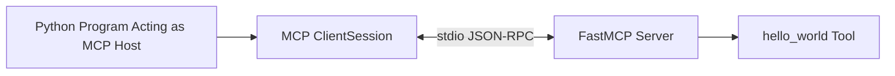
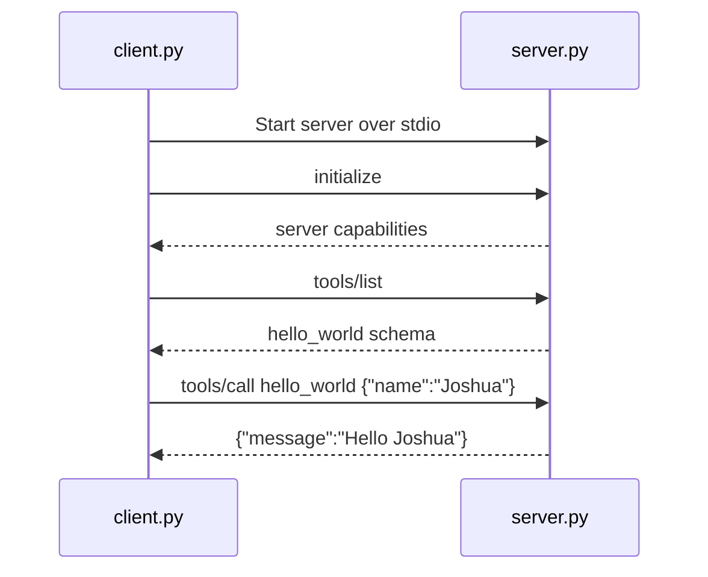

# Phase 1 MCP Learning Lab

This is the smallest useful MCP implementation in this repository.

It teaches MCP from first principles with one server, one client, and one tool.

## What MCP Is

MCP means **Model Context Protocol**.

It is a standard protocol that lets an AI application connect to external capabilities in a structured way.

Instead of hard-coding every integration directly into an AI app, MCP separates the system into:

- **Host**: the AI application or agent runtime
- **Client**: the protocol connector inside the host
- **Server**: the process that exposes capabilities
- **Tool**: a callable function exposed by the server

In this lab, the server exposes one tool:

```json
{
  "name": "hello_world",
  "input": {
    "name": "Joshua"
  },
  "output": {
    "message": "Hello Joshua"
  }
}
```

## Architecture



## Protocol Flow



## Setup

Use Python 3.12 or newer.

From this folder:

```bash
cd /Users/juanitamelosha/Desktop/MCP-build/mcp-poc-python/phase1_learning_lab
python3.12 -m venv .venv
source .venv/bin/activate
python -m pip install -r requirements.txt
```

If your default `python` is already Python 3.12+, this is also fine:

```bash
python -m venv .venv
source .venv/bin/activate
python -m pip install -r requirements.txt
```

## How To Run

### Option 1: Run The Client

This is the easiest path.

```bash
python client.py
```

Expected output:

```text
Discovered tools:
- hello_world: Return a friendly greeting for the provided name.

Tool execution result:
{
  "message": "Hello Joshua"
}
```

The client starts `server.py` automatically using MCP's `stdio` transport.

### Option 2: Run The Server Directly

```bash
python server.py
```

The server waits for MCP JSON-RPC messages on standard input. It may look quiet because stdio MCP servers are meant to be launched by clients.

Press `Ctrl+C` to stop it.

## File Explanation

### `server.py`

This file defines the MCP server.

It uses the official MCP Python SDK:

```python
from mcp.server.fastmcp import FastMCP
```

#### `mcp = FastMCP("Phase 1 MCP Learning Lab")`

Creates an MCP server object.

This object owns the list of tools exposed to clients.

#### `hello_world(name: str) -> dict[str, str]`

This is the only tool in Phase 1.

Input:

```json
{
  "name": "Joshua"
}
```

Output:

```json
{
  "message": "Hello Joshua"
}
```

#### `@mcp.tool()`

Registers the `hello_world` Python function as an MCP tool.

The MCP SDK reads the function name, docstring, type hints, and parameters to create a tool schema.

#### `mcp.run(transport="stdio")`

Starts the MCP server using stdio transport.

`stdio` means the client and server exchange JSON-RPC messages over standard input and standard output.

### `client.py`

This file defines the MCP client workflow.

It starts the server, connects to it, discovers tools, and executes `hello_world`.

#### `extract_text(result: Any) -> str`

Takes the raw MCP tool result and extracts the first text response.

MCP tool results can contain multiple content blocks. This lab only uses the first text block.

#### `main() -> None`

The main async client workflow.

It performs four protocol steps:

1. Starts `server.py` with `StdioServerParameters`
2. Opens stdio streams with `stdio_client`
3. Creates a `ClientSession`
4. Initializes, lists tools, and calls `hello_world`

#### `StdioServerParameters`

SDK class that tells the MCP client how to start the server process.

This lab uses:

```python
StdioServerParameters(command=sys.executable, args=[str(server_path)])
```

That means: use the current Python interpreter to run `server.py`.

#### `stdio_client(server)`

SDK function that starts the server process and opens read/write streams.

#### `ClientSession`

SDK class representing one MCP session with one MCP server.

The session sends protocol requests such as:

- `initialize`
- `tools/list`
- `tools/call`

#### `session.initialize()`

Starts the MCP handshake.

The client and server exchange capabilities.

#### `session.list_tools()`

Asks the server which tools it exposes.

In this lab, the response contains only:

```text
hello_world
```

#### `session.call_tool("hello_world", {"name": "Joshua"})`

Executes the tool on the server.

The server returns:

```json
{
  "message": "Hello Joshua"
}
```

## Classes In This Lab

This lab does not define custom classes.

It uses these SDK classes:

- `FastMCP`: creates and runs the MCP server
- `StdioServerParameters`: describes how to launch the server process
- `ClientSession`: manages one MCP client/server session

## Functions In This Lab

### Server Functions

- `hello_world`: the MCP tool

### Client Functions

- `extract_text`: reads the text payload from a tool result
- `main`: connects, discovers tools, and executes the tool

## What You Should Understand After Phase 1

You should now understand:

- An MCP server exposes tools.
- An MCP client connects to one server.
- Tool discovery happens before tool execution.
- Tool input is structured JSON.
- Tool output is structured data returned through the MCP protocol.
- `stdio` is useful for local MCP servers because the client can start the server process automatically.
