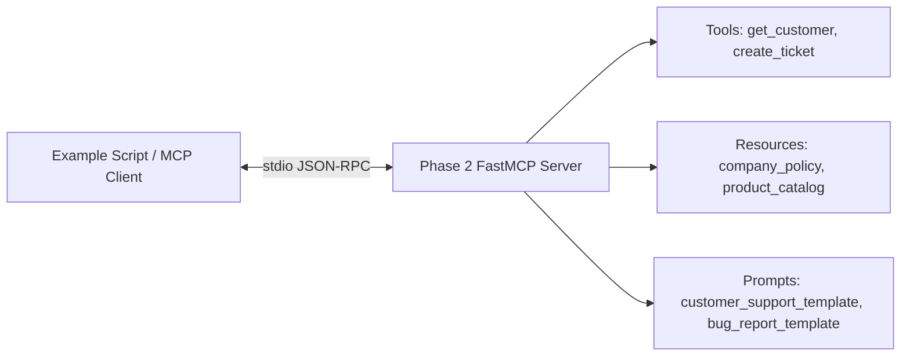
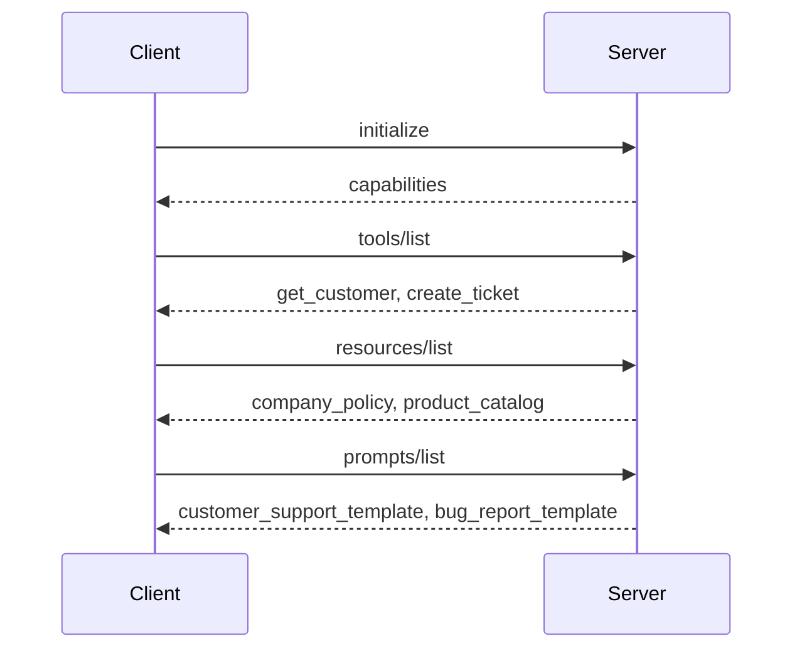
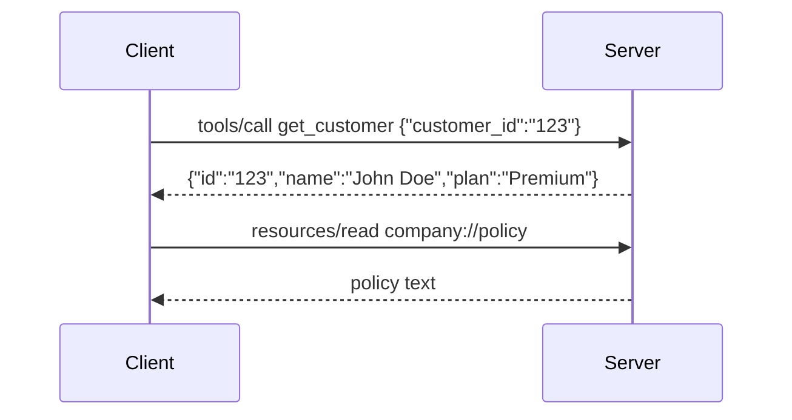

# Phase 2 MCP Learning Lab: Tools, Resources, and Prompts

Phase 1 taught one MCP server, one MCP client, and one tool.

Phase 2 adds the three core things most MCP servers expose:

- **Tools**
- **Resources**
- **Prompts**

There are no databases, APIs, OAuth flows, Atlassian setup steps, or Rovo setup steps in this module. Everything is local and beginner-friendly.

## What Is A Tool?

A **tool** is an action the MCP server can perform.

Use a tool when the client wants the server to **do something**.

Examples:

- Look up a customer
- Create a support ticket
- Send a message
- Search a private system

In this lab:

```json
{
  "tool": "get_customer",
  "input": {
    "customer_id": "123"
  },
  "output": {
    "id": "123",
    "name": "John Doe",
    "plan": "Premium"
  }
}
```

```json
{
  "tool": "create_ticket",
  "input": {
    "title": "Login Issue",
    "priority": "High"
  },
  "output": {
    "ticket_id": "T-1001",
    "status": "Created"
  }
}
```

## What Is A Resource?

A **resource** is readable context.

Use a resource when the client wants to **read information** from the server.

Examples:

- Company policy
- Product catalog
- Documentation
- Customer profile page
- File content

In this lab:

- `company://policy` named `company_policy`
- `company://product-catalog` named `product_catalog`

Resources are usually safer than tools because reading data should not create side effects.

## What Is A Prompt?

A **prompt** is a reusable instruction template.

Use a prompt when the server wants to give the client a standard way to ask the model to perform a task.

Examples:

- Customer support reply template
- Bug report template
- Incident summary template
- Code review template

In this lab:

- `customer_support_template`
- `bug_report_template`

Prompts do not execute business logic. They provide reusable language and structure.

## Tool vs Resource vs Prompt

| Concept | What It Means | Practical Example | Side Effects? |
|---|---|---|---|
| Tool | Do something | Create a support ticket | Often yes |
| Resource | Read something | Read company policy | No |
| Prompt | Template something | Draft a support reply | No direct system change |

## Architecture



## Discovery Flow



## Execution And Reading Flow



## Setup

Use Python 3.12 or newer.

```bash
cd /Users/juanitamelosha/Desktop/MCP-build/mcp-poc-python/phase2_tools_resources_prompts
python3.12 -m venv .venv
source .venv/bin/activate
python -m pip install -r requirements.txt
```

If your default `python` is already Python 3.12 or newer:

```bash
python -m venv .venv
source .venv/bin/activate
python -m pip install -r requirements.txt
```

## Run The Examples

Each example starts `server.py` automatically using MCP stdio transport.

```bash
python examples/list_tools.py
python examples/list_resources.py
python examples/list_prompts.py
python examples/read_resource.py
python examples/call_tool.py
```

## Expected Output

### Tool Discovery

```text
MCP tools:
- get_customer: Look up a customer by id.
- create_ticket: Create a customer support ticket.
```

### Resource Discovery

```text
MCP resources:
- company_policy: company://policy
- product_catalog: company://product-catalog
```

### Prompt Discovery

```text
MCP prompts:
- customer_support_template: Create a support response prompt.
- bug_report_template: Create an engineering bug report prompt.
```

### Resource Reading

```json
{
  "name": "Acme Support Policy",
  "support_hours": "24x7 for Premium customers"
}
```

### Tool Execution

```json
{
  "id": "123",
  "name": "John Doe",
  "plan": "Premium"
}
```

## Every File Explained

### `server.py`

Defines the MCP server.

It creates a `FastMCP` server and registers tools, resources, and prompts.

### `client_helpers.py`

Contains shared client code used by all example scripts.

This keeps each example short and focused on one learning goal.

### `examples/list_tools.py`

Connects to the server and prints discovered tools.

### `examples/list_resources.py`

Connects to the server and prints discovered resources.

### `examples/list_prompts.py`

Connects to the server and prints discovered prompts.

### `examples/read_resource.py`

Reads `company://policy` and prints the resource contents.

### `examples/call_tool.py`

Calls `get_customer` with `customer_id = "123"` and prints the result.

### `requirements.txt`

Installs the official MCP Python SDK.

## Every Class Explained

This phase does not define custom classes.

It uses these SDK classes:

- `FastMCP`: creates the MCP server and registers capabilities.
- `StdioServerParameters`: tells the client how to start the server process.
- `ClientSession`: represents one initialized MCP session between a client and server.

## Every Function Explained

### `server.py`

#### `get_customer(customer_id: str) -> dict[str, str]`

An MCP tool.

It accepts a customer id and returns a customer record.

#### `create_ticket(title: str, priority: str) -> dict[str, str]`

An MCP tool.

It accepts a title and priority, then returns a created ticket id.

#### `company_policy() -> str`

An MCP resource.

It returns company policy data as JSON text.

#### `product_catalog() -> str`

An MCP resource.

It returns product catalog data as JSON text.

#### `customer_support_template(...) -> str`

An MCP prompt.

It returns a reusable customer support instruction template.

#### `bug_report_template(...) -> str`

An MCP prompt.

It returns a reusable engineering bug report template.

### `client_helpers.py`

#### `connect_to_phase2_server()`

Starts the server with stdio, creates a `ClientSession`, initializes the MCP handshake, and yields the session to the example script.

#### `tool_result_to_json(result)`

Reads the first text block from a tool result and parses it as JSON.

#### `resource_result_to_text(result)`

Reads the first text block from a resource result.

### Example Scripts

Each example script has a `main()` function.

That function connects to the server and performs one MCP action:

- list tools
- list resources
- list prompts
- read resource
- call tool

## Summary

Use a **Tool** when the model or app needs the server to perform an action.

Use a **Resource** when the model or app needs to read context.

Use a **Prompt** when the model or app needs a reusable instruction template.

Enterprise MCP servers commonly expose all three:

- Tools for actions like creating Jira tickets, searching Confluence, updating CRM records, or triggering workflows.
- Resources for read-only context like policies, docs, tickets, catalog entries, or account data.
- Prompts for repeatable company workflows like incident summaries, support replies, sprint planning, bug reports, or compliance reviews.

Rovo MCP and similar enterprise MCP servers commonly map business systems into these concepts. For example, Jira issue creation is naturally a tool, Confluence page content is naturally a resource, and a standardized incident report format is naturally a prompt.

