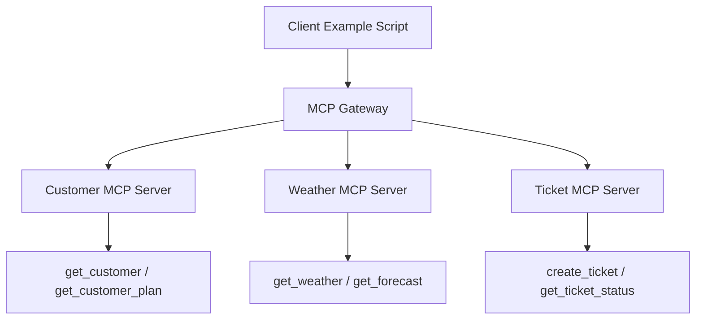
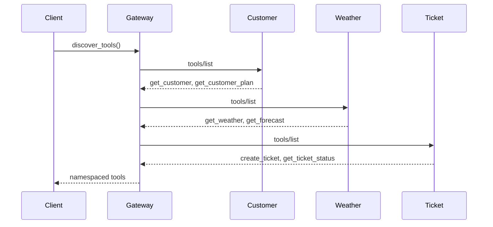
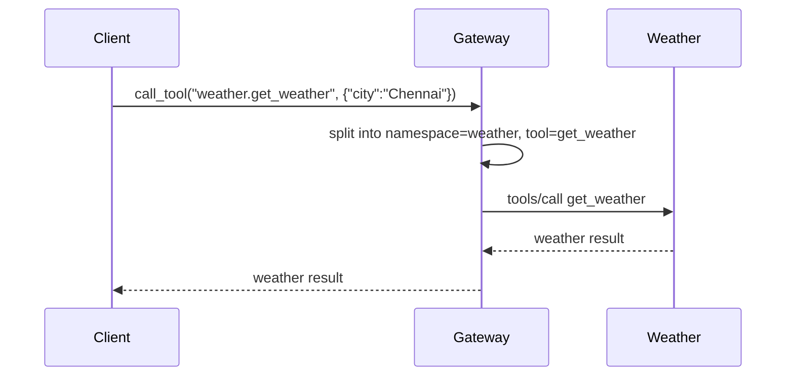

# Phase 3 MCP Learning Lab: Multiple MCP Servers Through A Gateway

Phase 1 introduced one MCP server and one MCP client.

Phase 2 introduced tools, resources, and prompts.

Phase 3 explains how multiple MCP servers can work together through an MCP Gateway.

## Architecture

```text
Client
  |
  v
MCP Gateway
  |
  +---------------- Customer MCP
  +---------------- Weather MCP
  +---------------- Ticket MCP
```



## Why Multiple MCP Servers Exist

Real systems are usually split by domain.

For example:

- Customer data belongs to a CRM or customer service system.
- Weather data belongs to a weather system.
- Tickets belong to a helpdesk system.

Putting everything into one huge MCP server becomes hard to maintain. Multiple MCP servers let each team own its own capabilities.

## Why Gateways Exist

An MCP Gateway gives the client one place to interact with many MCP servers.

Without a gateway, the client must know:

- Which servers exist
- How to connect to each one
- Which tool belongs to which server
- How to route each tool call

With a gateway, the client only talks to the gateway.

## Separation Of Concerns

Each server owns one business area:

| Server | Responsibility |
|---|---|
| Customer MCP | Customer data and plan lookup |
| Weather MCP | Weather and forecast data |
| Ticket MCP | Ticket creation and ticket status |
| MCP Gateway | Registration, discovery, namespacing, routing |

## Tool Discovery

Tool discovery means asking each MCP server:

```text
What tools do you expose?
```

The gateway asks all registered servers for their tools, then returns one combined list.



## Tool Routing

The gateway prefixes every tool with a namespace:

```text
customer.get_customer
weather.get_weather
ticket.create_ticket
```

The prefix tells the gateway where to route the request.



## Setup

Use Python 3.12 or newer.

```bash
cd /Users/juanitamelosha/Desktop/MCP-build/mcp-poc-python/phase3_mcp_gateway
python3.12 -m venv .venv
source .venv/bin/activate
python -m pip install -r requirements.txt
```

If your default `python` is already Python 3.12 or newer:

```bash
python -m venv .venv
source .venv/bin/activate
python -m pip install -r requirements.txt
```

## Run Examples

```bash
python examples/register_servers.py
python examples/list_servers.py
python examples/discover_all_tools.py
python examples/gateway_tool_call.py
```

Each example talks to the gateway. The examples do not directly call the customer, weather, or ticket servers.

## Expected Output

### Register Servers

```text
Registered MCP servers:
- customer
- ticket
- weather
```

### Discover Tools

```text
Namespaced MCP tools:
- customer.get_customer: Return a customer profile.
- customer.get_customer_plan: Return the customer's subscription plan.
- ticket.create_ticket: Create a support ticket.
- ticket.get_ticket_status: Return the status of a support ticket.
- weather.get_weather: Return the current weather for a city.
- weather.get_forecast: Return a simple multi-day forecast.
```

### Gateway Tool Call

```json
{
  "id": "123",
  "name": "John Doe",
  "plan": "Premium"
}
```

The same script also calls `weather.get_weather` and `ticket.create_ticket`.

## Every File Explained

### `servers/customer_server.py`

Defines the Customer MCP server.

It exposes:

- `get_customer`
- `get_customer_plan`

### `servers/weather_server.py`

Defines the Weather MCP server.

It exposes:

- `get_weather`
- `get_forecast`

### `servers/ticket_server.py`

Defines the Ticket MCP server.

It exposes:

- `create_ticket`
- `get_ticket_status`

### `gateway.py`

Defines the MCP Gateway.

It registers servers, discovers tools from all servers, prefixes tools by namespace, and routes tool calls.

### `examples/register_servers.py`

Builds the default gateway and prints the servers that were registered.

### `examples/list_servers.py`

Prints all registered gateway namespaces.

### `examples/discover_all_tools.py`

Asks the gateway to discover tools from every registered MCP server.

### `examples/gateway_tool_call.py`

Calls tools through the gateway only.

It demonstrates:

- `customer.get_customer`
- `weather.get_weather`
- `ticket.create_ticket`

### `requirements.txt`

Installs the official MCP Python SDK.

## Every Class Explained

### `MCPServerConfig`

A small dataclass that stores one server's namespace and Python script path.

Example:

```python
MCPServerConfig(
    namespace="customer",
    script_path=Path("servers/customer_server.py"),
)
```

### `NamespacedTool`

A small dataclass that represents a discovered tool after the gateway adds the namespace.

Example:

```text
customer.get_customer
```

It stores:

- `name`: the public gateway tool name
- `description`: the tool description
- `server_namespace`: the server namespace
- `original_name`: the real tool name on the MCP server

### `MCPGateway`

The main gateway class.

It hides multiple MCP servers behind one Python object.

The client interacts with:

```python
gateway.discover_tools()
gateway.call_tool(...)
```

instead of connecting to each MCP server directly.

## Every Function Explained

### Server Functions

#### `get_customer(customer_id)`

Customer MCP tool that returns a customer profile.

#### `get_customer_plan(customer_id)`

Customer MCP tool that returns the customer's subscription plan.

#### `get_weather(city)`

Weather MCP tool that returns current weather.

#### `get_forecast(city, days)`

Weather MCP tool that returns a simple forecast.

#### `create_ticket(title, priority)`

Ticket MCP tool that creates a support ticket.

#### `get_ticket_status(ticket_id)`

Ticket MCP tool that returns ticket status.

### Gateway Functions

#### `register_server(namespace, script_path)`

Adds one MCP server to the gateway.

The namespace becomes the prefix for that server's tools.

#### `remove_server(namespace)`

Removes a server from the gateway.

#### `list_servers()`

Returns all registered namespaces.

#### `discover_tools()`

Connects to every registered MCP server, asks for its tools, prefixes each tool name, and returns the combined list.

#### `call_tool(namespaced_tool_name, arguments)`

Routes a namespaced tool call to the correct server.

Example:

```python
await gateway.call_tool("ticket.create_ticket", {"title": "Login Issue", "priority": "High"})
```

#### `_connect(config)`

Internal helper that starts one stdio MCP server and creates an initialized `ClientSession`.

#### `_split_tool_name(namespaced_tool_name)`

Internal helper that splits:

```text
weather.get_weather
```

into:

```text
namespace = weather
tool = get_weather
```

#### `_tool_result_to_json(result)`

Internal helper that converts the first MCP text result block into a Python dictionary.

#### `build_default_gateway()`

Convenience function that registers all three Phase 3 servers:

- customer
- weather
- ticket

## Success Criteria

This phase succeeds when:

- Multiple MCP servers run successfully.
- The gateway registers servers.
- The gateway discovers tools.
- The gateway routes tool calls correctly.
- The client interacts through the gateway only.

## How This Evolves

### Rovo MCP

Rovo-style enterprise MCP uses the same idea at a larger scale. Instead of local toy servers, the gateway may connect to Atlassian/Rovo capabilities for Jira, Confluence, planning, search, and organizational knowledge.

### GitHub MCP

GitHub MCP can expose repository, issue, pull request, branch, and workflow tools. A gateway can namespace those tools as:

```text
github.list_issues
github.create_pull_request
github.get_file_contents
```

### Slack MCP

Slack MCP can expose messaging and workspace context:

```text
slack.search_messages
slack.post_message
slack.list_channels
```

### Enterprise MCP Ecosystems

Large companies often have many systems:

- CRM
- Helpdesk
- HR
- Finance
- Code hosting
- Documentation
- Chat
- Data warehouses

Each system can expose its own MCP server. A gateway lets an agent discover and route across all of them.

### Agent Marketplaces

An agent marketplace is a natural next step.

Instead of hard-coding servers, a marketplace can publish available MCP servers, scopes, tools, descriptions, owners, and approval workflows.

The gateway becomes the agent's control plane:

- What servers are available?
- What tools are approved?
- Which tools require confirmation?
- Which tools can this user access?
- Where should this tool call be routed?

