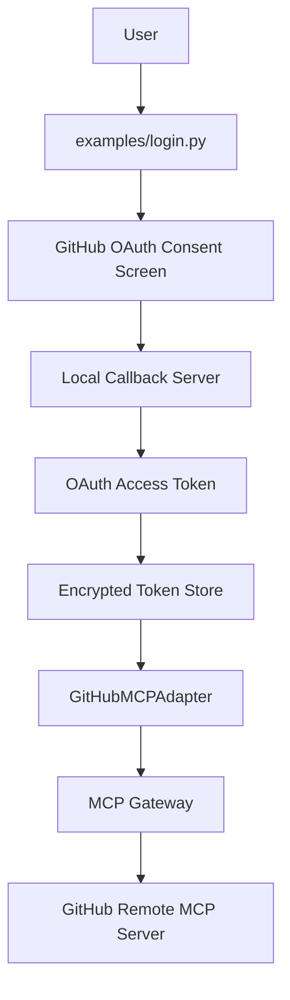
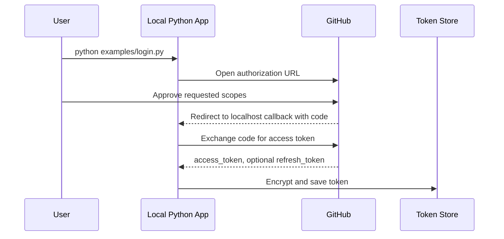

# Phase 5 MCP Learning Lab: GitHub MCP With OAuth

Phase 5 integrates with a real vendor MCP ecosystem using OAuth.

This phase starts with GitHub before Atlassian/Rovo because GitHub OAuth and GitHub's remote MCP server are the most approachable first vendor path.

## What You Build

```text
Example Client
  |
  v
MCP Gateway
  |
  v
GitHubMCPAdapter
  |
  +-- OAuth token store
  +-- Token refresh
  +-- Authorization: Bearer <access_token>
  |
  v
GitHub Remote MCP Server
```



## OAuth 2.0

OAuth 2.0 is an authorization framework.

It lets a user grant an application access to a service without giving the application the user's password.

For this lab:

- GitHub is the authorization server.
- Your local Python app is the OAuth client.
- GitHub MCP is the protected vendor MCP server.
- The access token is what your MCP client sends to GitHub MCP.

## Authorization Code Flow

This lab implements the OAuth Authorization Code Flow.



## Access Tokens

An access token is a credential used to access protected resources.

For remote MCP, the token is sent like this:

```http
Authorization: Bearer <access_token>
```

## Refresh Tokens

A refresh token is used to get a new access token after the old one expires.

GitHub OAuth Apps may not always return refresh tokens. They are available when expiring user tokens are enabled for the OAuth App.

This lab supports refresh tokens when GitHub returns one.

## Scopes

Scopes define what your app can access.

Example:

```env
GITHUB_OAUTH_SCOPES=repo read:user read:org
```

Start with the smallest scopes you need. Broader scopes can expose more data and should be handled carefully.

## Secure Credential Storage

This lab stores tokens in:

```text
.tokens.json
```

The file is encrypted using a local key stored in:

```text
.token_key
```

Both files are ignored by git.

This is good enough for a learning lab. Production systems should use a platform secret manager such as 1Password, AWS Secrets Manager, GCP Secret Manager, Azure Key Vault, HashiCorp Vault, or an enterprise credential service.

## GitHub Setup

Create a GitHub OAuth App:

1. Go to GitHub.
2. Open **Settings**.
3. Open **Developer settings**.
4. Open **OAuth Apps**.
5. Click **New OAuth App**.
6. Set **Homepage URL** to:

```text
http://127.0.0.1:8766
```

7. Set **Authorization callback URL** to:

```text
http://127.0.0.1:8766/callback
```

8. Copy the Client ID and Client Secret.

Create your local `.env`:

```bash
cd /Users/juanitamelosha/Desktop/MCP-build/mcp-poc-python/phase5_github_oauth
cp .env.example .env
```

Edit `.env`:

```env
GITHUB_OAUTH_CLIENT_ID=your_client_id
GITHUB_OAUTH_CLIENT_SECRET=your_client_secret
GITHUB_OAUTH_REDIRECT_URI=http://127.0.0.1:8766/callback
GITHUB_OAUTH_SCOPES=repo read:user read:org
GITHUB_MCP_URL=https://api.githubcopilot.com/mcp/
```

## Setup

Use Python 3.12 or newer.

```bash
cd /Users/juanitamelosha/Desktop/MCP-build/mcp-poc-python/phase5_github_oauth
python3.12 -m venv .venv
source .venv/bin/activate
python -m pip install -r requirements.txt
```

## Run

### 1. Login

```bash
python examples/login.py
```

Expected behavior:

- Browser opens GitHub OAuth consent screen.
- You approve access.
- Browser redirects to localhost.
- Token is encrypted and saved.

### 2. Discover GitHub MCP Tools

```bash
python examples/discover_github_tools.py
```

Expected output:

```text
GitHub MCP tools:
- github.some_tool: ...
- github.another_tool: ...
```

The exact tools depend on your GitHub account, scopes, and GitHub MCP availability.

### 3. Call A GitHub MCP Tool

First discover tools:

```bash
python examples/discover_github_tools.py
```

Then set the tool name and arguments in `.env`:

```env
GITHUB_MCP_TOOL=github.some_tool
GITHUB_MCP_TOOL_ARGS={}
```

Run:

```bash
python examples/call_github_tool.py
```

If `GITHUB_MCP_TOOL` is blank, the script prints available tools so you can choose one.

### 4. Refresh Token

```bash
python examples/refresh_token.py
```

This works only if GitHub issued a refresh token.

### 5. Expiry Demo

```bash
python examples/token_expiry_demo.py
```

This marks the stored token as expired and shows whether automatic refresh can recover.

## Error Handling

This phase handles:

- Missing OAuth client id or secret
- Missing stored token
- Expired token with no refresh token
- Refresh failures
- Vendor MCP tool failures
- Invalid or insufficient scopes, surfaced by GitHub MCP responses

## Every File Explained

### `.env.example`

Template for OAuth and GitHub MCP configuration.

### `.gitignore`

Prevents local secrets from being committed:

- `.env`
- `.token_key`
- `.tokens.json`
- virtual environments
- Python bytecode

### `requirements.txt`

Installs:

- `mcp`
- `httpx`
- `python-dotenv`
- `cryptography`

### `oauth/github_provider.py`

GitHub-specific OAuth configuration.

It knows the authorization URL, token URL, redirect URI, scopes, client id, client secret, and GitHub MCP URL.

### `oauth/oauth_client.py`

Performs token HTTP calls:

- Exchange authorization code for access token.
- Refresh access token.

### `oauth/token_store.py`

Encrypts and stores OAuth tokens locally.

### `oauth/auth_flow.py`

Runs the browser-based OAuth Authorization Code Flow.

### `vendor_adapter.py`

Defines the vendor adapter abstraction and the GitHub implementation.

### `gateway.py`

Defines an MCP Gateway that registers vendor adapters and routes namespaced tool calls.

### `examples/login.py`

Runs OAuth login and stores the token.

### `examples/discover_github_tools.py`

Connects to GitHub MCP and lists tools.

### `examples/call_github_tool.py`

Calls a GitHub MCP tool configured through `.env`.

### `examples/refresh_token.py`

Forces a token refresh.

### `examples/token_expiry_demo.py`

Marks the local token as expired and demonstrates refresh behavior.

## Every Class Explained

### `GitHubOAuthProvider`

Stores GitHub OAuth and MCP configuration.

### `OAuthToken`

Represents a stored token:

- access token
- refresh token
- scopes
- expiration time
- token type

### `TokenStore`

Encrypts, saves, loads, and deletes tokens.

### `OAuthClient`

Talks to GitHub's OAuth token endpoint.

### `AuthorizationCodeFlow`

Opens the browser, waits for the callback, and exchanges the code.

### `_CallbackServer`

Tiny local callback server used only during login.

### `VendorAdapter`

Abstract base class for vendor MCP integrations.

### `GitHubMCPAdapter`

Vendor adapter for GitHub MCP.

It loads tokens, refreshes expired tokens when possible, and connects to GitHub MCP.

### `NamespacedVendorTool`

Represents a gateway tool such as:

```text
github.some_tool
```

### `MCPGateway`

Registers vendor adapters, discovers vendor tools, and routes calls.

## Every Function Explained

### `GitHubOAuthProvider.from_env()`

Loads GitHub OAuth settings from `.env`.

### `GitHubOAuthProvider.authorization_url(state)`

Builds the GitHub login URL.

### `OAuthToken.is_expired(leeway_seconds)`

Checks whether a token is expired or nearly expired.

### `TokenStore.save(provider, token)`

Encrypts and saves a token.

### `TokenStore.load(provider)`

Loads and decrypts a token.

### `TokenStore.delete(provider)`

Deletes a token.

### `OAuthClient.exchange_code(code)`

Exchanges an authorization code for an access token.

### `OAuthClient.refresh(refresh_token)`

Uses a refresh token to get a new access token.

### `AuthorizationCodeFlow.login()`

Runs the full login flow.

### `_CallbackServer.wait_for_code(redirect_uri)`

Starts a local HTTP callback server and waits for GitHub's redirect.

### `VendorAdapter.list_tools()`

Connects to the vendor MCP server and lists tools.

### `VendorAdapter.call_tool(tool_name, arguments)`

Calls a vendor MCP tool.

### `GitHubMCPAdapter.get_access_token()`

Loads the GitHub token and refreshes it if needed.

### `GitHubMCPAdapter.refresh_token()`

Forces a refresh of the stored GitHub token.

### `MCPGateway.register_vendor(adapter)`

Registers a vendor adapter.

### `MCPGateway.discover_tools()`

Lists tools from every registered vendor adapter.

### `MCPGateway.call_tool(namespaced_tool_name, arguments)`

Routes a namespaced tool call to the correct vendor adapter.

## GitHub MCP vs Self-Hosted MCP

Self-hosted MCP:

- You own the server.
- You define the tools.
- You control auth and deployment.
- It often runs locally or inside your network.

GitHub MCP:

- GitHub owns the server.
- GitHub defines available tools.
- GitHub controls auth, scopes, and availability.
- Your client connects remotely with OAuth credentials.

## OAuth vs API Key Auth

API key auth:

- Simple shared secret.
- Often tied to an app or service account.
- Usually manually created and rotated.

OAuth:

- User-centered authorization.
- Consent-based.
- Scope-based.
- Can support refresh tokens.
- Better fit for vendor ecosystems and delegated access.

## How This Prepares For Atlassian Rovo MCP

Atlassian/Rovo MCP follows the same high-level pattern:

```text
OAuth login -> token storage -> bearer token -> remote MCP endpoint -> gateway namespace
```

To add Rovo later, create:

- `AtlassianOAuthProvider`
- `AtlassianMCPAdapter`
- Atlassian scopes
- Atlassian token refresh logic
- Gateway registration under `atlassian` or `rovo`

The gateway does not need to know vendor-specific OAuth details. That is the main architectural win.

## Official References

- GitHub MCP server: https://github.com/github/github-mcp-server
- GitHub OAuth Apps authorization: https://docs.github.com/en/apps/oauth-apps/building-oauth-apps/authorizing-oauth-apps
- MCP authorization specification: https://modelcontextprotocol.io/specification/2025-06-18/basic/authorization

