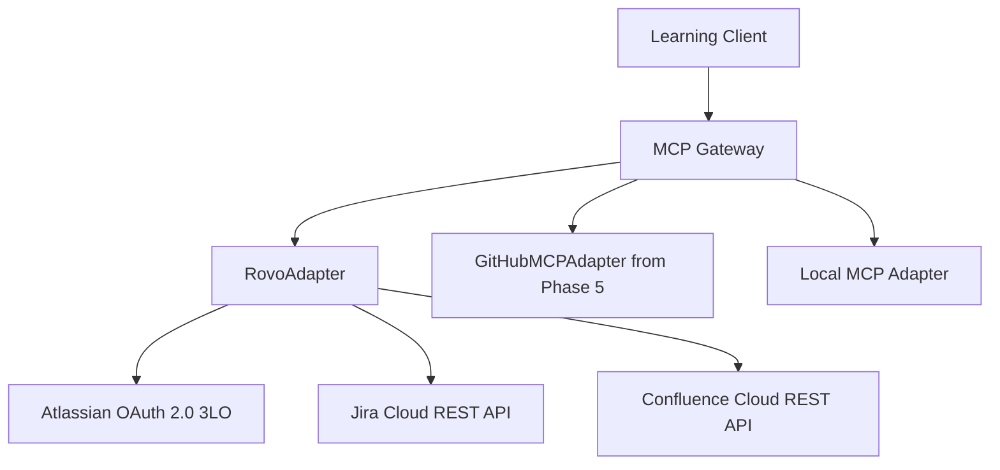
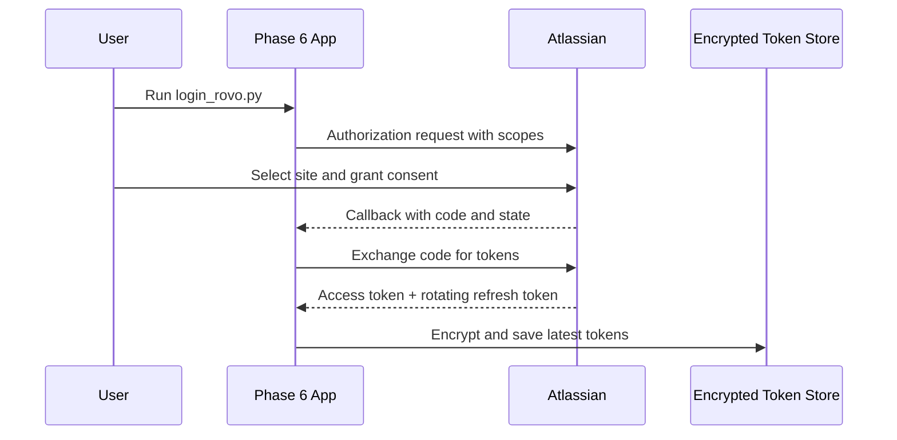
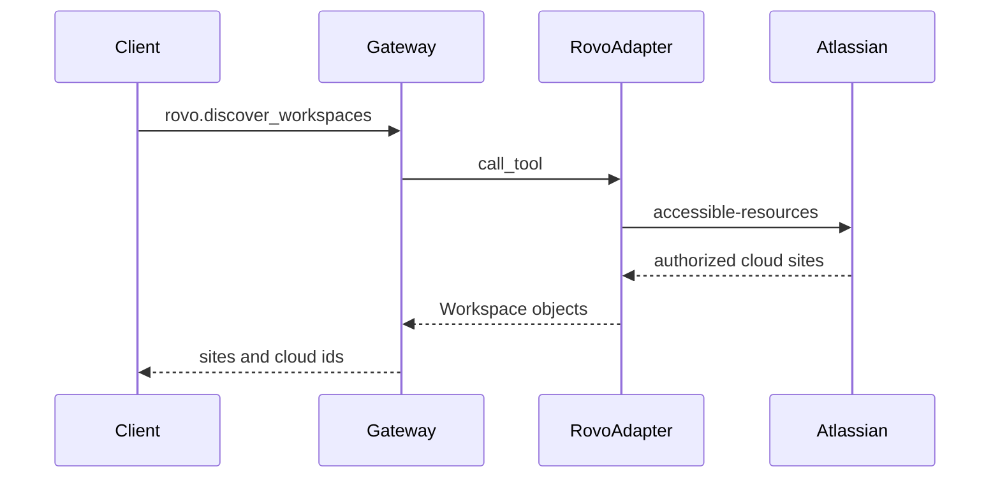

# Phase 6: Atlassian/Rovo Integration

Phase 6 adds Atlassian OAuth, Jira tools, Confluence resources, and a Rovo-compatible provider boundary to the MCP learning platform.

Read [docs/rovo_overview.md](docs/rovo_overview.md) first.

## Important Accuracy Note

This implementation uses officially documented:

- Atlassian OAuth 2.0 (3LO)
- Accessible-resource discovery
- Jira Cloud REST APIs
- Confluence Cloud REST APIs

The class is named `RovoAdapter` because it is the learning platform's Atlassian/Rovo provider boundary.

It does **not** claim that REST calls are native Rovo MCP calls. A stable public custom-client Rovo MCP endpoint and versioned tool contract were not verified in official Atlassian developer documentation during the June 18, 2026 research pass.

## Architecture



## OAuth Flow



## Workspace Discovery

Atlassian calls Jira/Confluence sites accessible resources.

The adapter calls:

```text
GET https://api.atlassian.com/oauth/token/accessible-resources
```

Each result includes a cloud id, name, URL, and granted scopes.



## Project Discovery

After selecting a cloud id, `discover_projects()` calls Jira's project search API.

The OAuth token and Jira project permissions determine which projects are returned.

## Tool Mapping

| Gateway Tool | Official Backend |
|---|---|
| `rovo.discover_workspaces` | Atlassian accessible resources |
| `rovo.discover_projects` | Jira project search |
| `rovo.create_jira_ticket` | Jira create issue |
| `rovo.get_issue` | Jira get issue |
| `rovo.search_issues` | Jira enhanced JQL search |
| `rovo.update_issue` | Jira edit issue |
| `rovo.list_pages` | Confluence v2 page list |
| `rovo.read_page` | Confluence v2 page read |
| `rovo.search_pages` | Confluence CQL search |

## Resource Mapping

`discover_resources()` maps Confluence pages into gateway-friendly metadata:

```text
confluence://{cloud_id}/pages/{page_id}
```

This is a learning-platform URI, not an Atlassian-native MCP resource URI.

## Create An Atlassian OAuth App

1. Open the Atlassian developer console:

   https://developer.atlassian.com/console/myapps/

2. Create an app.

3. Open **Authorization**.

4. Configure **OAuth 2.0 (3LO)**.

5. Set the callback URL exactly to:

```text
http://127.0.0.1:8767/callback
```

6. Open **Permissions**.

7. Add the Jira platform API.

8. Add the Confluence API.

9. Configure the required scopes.

For this educational implementation:

```text
read:jira-work
write:jira-work
read:jira-user
read:confluence-content.all
search:confluence
offline_access
```

10. Copy the OAuth client id and secret.

Do not use an Atlassian API token in these fields. This phase uses OAuth 2.0 3LO.

## Local Setup

```bash
cd /Users/juanitamelosha/Desktop/MCP-build/mcp-poc-python/phase6_atlassian_rovo
python3.12 -m venv .venv
source .venv/bin/activate
python -m pip install -r requirements.txt
cp .env.example .env
```

Edit `.env`:

```env
ATLASSIAN_CLIENT_ID=your_oauth_client_id
ATLASSIAN_CLIENT_SECRET=your_oauth_client_secret
ATLASSIAN_REDIRECT_URI=http://127.0.0.1:8767/callback
ATLASSIAN_SCOPES=read:jira-work write:jira-work read:jira-user read:confluence-content.all search:confluence offline_access

ATLASSIAN_CLOUD_ID=
ATLASSIAN_JIRA_PROJECT_KEY=
ATLASSIAN_CONFLUENCE_PAGE_ID=
```

`.env`, `.tokens.json`, and `.token_key` are ignored by git.

## Run Step By Step

### 1. OAuth Login

```bash
python examples/login_rovo.py
```

The browser opens Atlassian consent.

After success, the script prints accessible sites:

```text
Authorized workspaces/sites:
- Example Company: cloud_id=abc123..., url=https://example.atlassian.net
```

Copy the selected cloud id into `.env`:

```env
ATLASSIAN_CLOUD_ID=abc123...
```

### 2. Discover Workspaces Again

```bash
python examples/discover_workspaces.py
```

### 3. Discover Jira Projects

```bash
python examples/discover_projects.py
```

Expected shape:

```text
Jira projects:
- DEMO: Demo Project (id=10001)
```

Copy the desired key:

```env
ATLASSIAN_JIRA_PROJECT_KEY=DEMO
```

The implementation also accepts a numeric Jira project id such as `10000`,
although a human-readable project key such as `DEMO` is easier to recognize.

### 4. Discover Gateway Tools

```bash
python examples/discover_gateway_tools.py
```

### 5. Search Jira Issues

Set the project key discovered in the previous step:

```env
ATLASSIAN_JIRA_PROJECT_KEY=DEMO
```

The example uses a bounded JQL query:

```text
project = "DEMO" ORDER BY created DESC
```

```bash
python examples/search_issues.py
```

### 6. Create A Jira Issue

This performs a real write.

```bash
python examples/create_ticket.py
```

The selected project must support the `Task` issue type and your user must have permission to create issues.

### 7. Read A Confluence Page

Put a page id in `.env`:

```env
ATLASSIAN_CONFLUENCE_PAGE_ID=123456
```

Then:

```bash
python examples/read_confluence.py
```

## Token Refresh

The requested `offline_access` scope allows Atlassian to issue refresh tokens.

Atlassian uses rotating refresh tokens:

1. The adapter detects an expired access token.
2. It exchanges the current refresh token.
3. Atlassian may return a new refresh token.
4. The adapter immediately replaces the stored token record.

Never keep using an older rotating refresh token after a successful refresh.

## Scope And Permission Errors

`401` commonly means:

- Token missing, expired, revoked, or invalid.
- Refresh failed.

`403` commonly means:

- OAuth scope is missing.
- The user lacks Jira or Confluence permission.
- An organization app-access rule blocks access.

`404` can mean:

- Wrong cloud id.
- Wrong issue/page id.
- The user cannot see the requested object.

## Gateway With GitHub, Rovo, And Local MCP

The gateway uses structural adapters. The Phase 5 `GitHubMCPAdapter` and Phase 6 `RovoAdapter` both expose:

```python
name
list_tools()
call_tool()
```

Conceptually:

```python
gateway = MCPGateway()
gateway.register_provider(github_adapter)
gateway.register_provider(rovo_adapter)
gateway.register_local_server("customer", customer_server_path)

tools = await gateway.discover_tools()

await gateway.call_tool("github.some_tool", {})
await gateway.call_tool("rovo.search_issues", {"jql": "project = DEMO"})
await gateway.call_tool("customer.get_customer", {"customer_id": "123"})
```

Each phase is kept independently runnable, so a production repository would move the shared gateway and OAuth interfaces into one common package.

## Every File

### `docs/rovo_overview.md`

Official-support research and REST-versus-Rovo-MCP boundary.

### `oauth/atlassian_oauth.py`

OAuth configuration, authorization URL, code exchange, and refresh requests.

### `oauth/token_store.py`

Encrypted access/refresh token storage.

### `oauth/auth_flow.py`

Browser login and local callback server.

### `providers/rovo_adapter.py`

Workspace discovery, Jira tools, Confluence resources, token refresh, and API errors.

### `gateway.py`

Common gateway for vendor adapters and local stdio MCP servers.

### `examples/common.py`

Loads environment variables and constructs the adapter/gateway.

### `examples/login_rovo.py`

Runs OAuth login and prints accessible workspaces.

### `examples/discover_workspaces.py`

Discovers authorized Atlassian sites through the gateway.

### `examples/discover_projects.py`

Discovers Jira projects through the gateway.

### `examples/discover_gateway_tools.py`

Lists namespaced Rovo adapter tools.

### `examples/create_ticket.py`

Creates a real Jira issue through `rovo.create_jira_ticket`.

### `examples/read_confluence.py`

Reads a Confluence page through `rovo.read_page`.

### `examples/search_issues.py`

Runs a JQL issue search through `rovo.search_issues`.

## Every Class

### `OAuthToken`

Stores access token, rotating refresh token, expiry, scopes, and token type.

### `TokenStore`

Encrypts and persists OAuth tokens with owner-only file permissions.

### `AtlassianOAuthConfig`

Contains client credentials, callback URI, scopes, and official OAuth endpoints.

### `AtlassianOAuthClient`

Exchanges authorization codes and refresh tokens.

### `AtlassianAuthorizationCodeFlow`

Coordinates browser consent and the callback.

### `_CallbackServer`

Temporary localhost HTTP listener for the OAuth redirect.

### `Workspace`

Represents an Atlassian accessible resource/cloud site.

### `AdapterTool`

Gateway-friendly description of an Atlassian operation.

### `AdapterResource`

Gateway-friendly description of a Confluence page.

### `RovoAdapter`

The Atlassian ecosystem adapter backed by official Jira and Confluence REST APIs.

### `GatewayProvider`

Protocol that vendor adapters implement.

### `LocalMCPConfig`

Configuration for a local stdio MCP server.

### `LocalMCPAdapter`

Makes a local MCP server conform to the gateway provider interface.

### `MCPGateway`

Registers providers, discovers namespaced tools, and routes tool calls.

## Every Important Function

### OAuth

- `AtlassianOAuthConfig.from_env()`: loads OAuth settings.
- `authorization_url()`: creates the Atlassian consent URL.
- `exchange_code()`: exchanges a callback code for tokens.
- `refresh()`: rotates expired tokens.
- `TokenStore.save()`: encrypts the latest token.
- `TokenStore.load()`: decrypts the token.
- `login()`: runs browser authorization.

### Rovo Adapter

- `authenticate()`: loads or refreshes the token.
- `discover_workspaces()`: finds authorized cloud sites.
- `discover_projects()`: lists Jira projects.
- `discover_resources()`: maps Confluence pages to resources.
- `call_tool()`: routes adapter tool names.
- `create_jira_ticket()`: creates an issue.
- `get_issue()`: reads an issue.
- `search_issues()`: searches with JQL.
- `update_issue()`: updates issue fields.
- `list_pages()`: lists Confluence pages.
- `read_page()`: reads a page.
- `search_pages()`: searches pages with CQL.

### Gateway

- `register_provider()`: registers GitHub or Rovo adapters.
- `register_local_server()`: registers a local stdio MCP.
- `remove_provider()`: removes a provider.
- `list_providers()`: lists namespaces.
- `discover_tools()`: combines namespaced tools.
- `call_tool()`: routes a namespaced call.

## Official References

- OAuth 2.0 3LO: https://developer.atlassian.com/cloud/jira/platform/oauth-2-3lo-apps/
- Jira Cloud REST v3: https://developer.atlassian.com/cloud/jira/platform/rest/v3/
- Jira issues: https://developer.atlassian.com/cloud/jira/platform/rest/v3/api-group-issues/
- Confluence pages: https://developer.atlassian.com/cloud/confluence/rest/v2/api-group-page/
- Confluence search: https://developer.atlassian.com/cloud/confluence/rest/v1/api-group-search/
