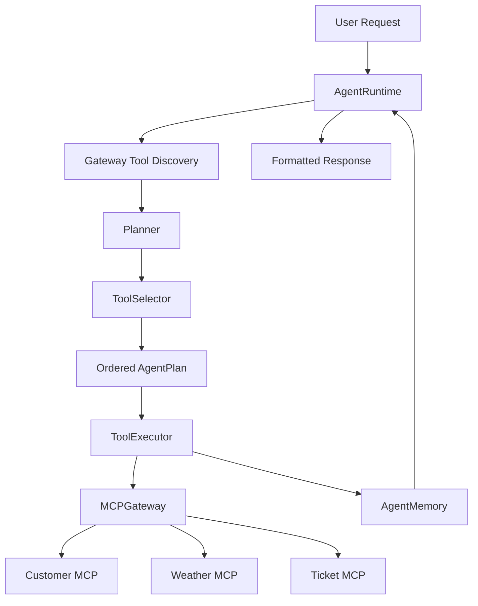
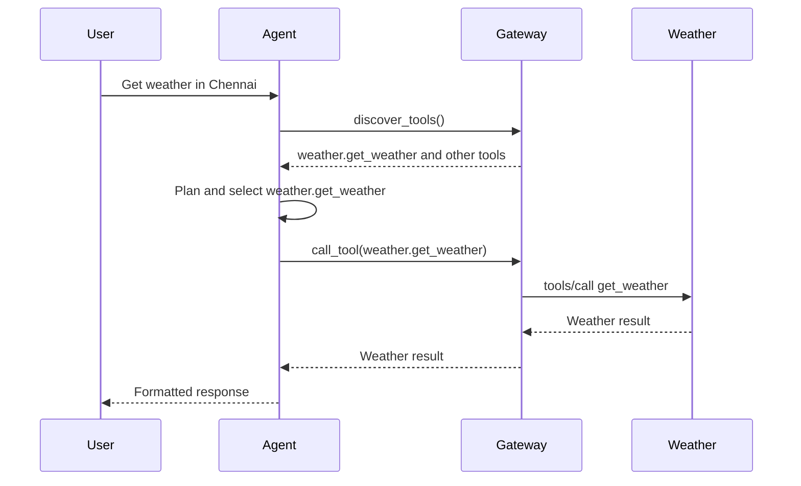
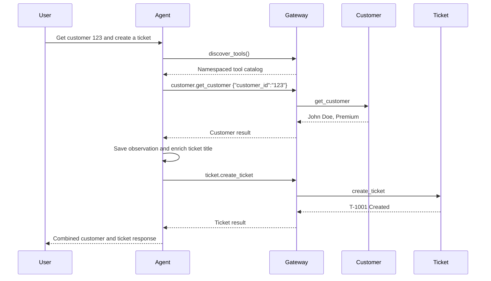

# Phase 7: Dynamic MCP Agent Runtime

Phase 7 builds an agent runtime that discovers and uses MCP tools dynamically.

```text
User
  |
  v
Agent Runtime
  |
  v
MCP Gateway
  |
  +-- Customer MCP
  +-- Weather MCP
  +-- Ticket MCP
```

The planner is intentionally rule-based. This makes every planning and tool-selection decision visible and avoids requiring an LLM API for the learning exercise.

## Agent Runtime

An **Agent Runtime** coordinates the complete task lifecycle:

1. Receive a user request.
2. Discover available MCP tools.
3. Create a plan.
4. Select tools.
5. Execute tools through the gateway.
6. Store observations in memory.
7. Format a final response.

## Planning

Planning converts a user request into ordered actions.

For:

```text
Get customer 123 and create a ticket
```

The planner produces:

```text
Step 1: customer.get_customer
Step 2: ticket.create_ticket
```

The second step can use information returned by the first step.

## Tool Selection

Tool selection maps an intent to a tool that was actually discovered.

Examples:

| Intent | Discovered Tool |
|---|---|
| Get a customer | `customer.get_customer` |
| Get weather | `weather.get_weather` |
| Create a ticket | `ticket.create_ticket` |

The agent does not call a tool unless it appears in gateway discovery.

## Tool Execution

The executor calls tools only through `MCPGateway`.

It does not connect directly to Customer MCP, Weather MCP, or Ticket MCP.

Each result becomes an observation stored in agent memory.

## Memory

Memory stores:

- User messages
- Final agent responses
- Tool names
- Tool arguments
- Tool results

This phase uses in-memory storage. It resets when the Python process ends.

Future phases could replace it with Redis, PostgreSQL, a vector store, or an agent-state service without changing the planner/executor contract.

## Architecture



## Single-Step Flow



## Multi-Step Flow



## Setup

Use Python 3.12 or newer.

```bash
cd /Users/juanitamelosha/Desktop/MCP-build/mcp-poc-python/phase7_agent_runtime
python3.12 -m venv .venv
source .venv/bin/activate
python -m pip install -r requirements.txt
```

The module reuses the Phase 3 customer, weather, and ticket server scripts.

## Run Examples

### Get Customer

```bash
python examples/get_customer.py
```

### Get Weather

```bash
python examples/get_weather.py
```

### Create Ticket

```bash
python examples/create_ticket.py
```

### Multi-Step Workflow

```bash
python examples/customer_ticket_workflow.py
```

Expected result:

```text
Workflow completed:

Step 1 - customer.get_customer
{
  "id": "123",
  "name": "John Doe",
  "plan": "Premium"
}

Step 2 - ticket.create_ticket
{
  "ticket_id": "T-1001",
  "status": "Created",
  "priority": "High",
  "title": "Support request for customer 123 - John Doe"
}
```

### Interactive Agent

```bash
python examples/interactive_agent.py
```

Try:

```text
Get customer 123
Get weather in Chennai
Create a High priority ticket for a login issue
Get customer 123 and create a ticket
```

## Logging

Logs show observable agent decisions:

```text
Discovering tools from the MCP Gateway
Discovered 6 tools: [...]
Created plan: [...]
Executing step 1: intent=get_customer tool=customer.get_customer ...
Step 1 succeeded: customer.get_customer
```

These are planning and execution records, not hidden model reasoning.

## Every File

### `gateway.py`

Registers the Phase 3 customer, weather, and ticket servers.

It dynamically discovers tools and routes namespaced calls.

### `agent/runtime.py`

Coordinates discovery, planning, execution, memory, and final formatting.

### `agent/planner.py`

Parses supported user requests and creates ordered plans.

It also enriches later steps with earlier results.

### `agent/tool_selector.py`

Matches supported intents to tools present in dynamic discovery.

### `agent/executor.py`

Executes each plan step through the gateway and records observations.

### `agent/memory.py`

Stores messages and tool observations for the current process.

### `examples/common.py`

Configures logging and builds the agent.

### `examples/get_customer.py`

Runs customer lookup.

### `examples/get_weather.py`

Runs weather lookup.

### `examples/create_ticket.py`

Runs ticket creation.

### `examples/customer_ticket_workflow.py`

Runs the required multi-step workflow.

### `examples/interactive_agent.py`

Accepts a request from the terminal.

### `requirements.txt`

Installs the official MCP Python SDK.

## Every Class

### `ToolInfo`

Metadata discovered for one MCP tool:

- Namespaced name
- Description
- Input schema

### `ServerConfig`

Stores a namespace and MCP server script path.

### `MCPGateway`

Discovers and calls tools across MCP servers.

### `Observation`

Records one completed tool call:

- Tool name
- Arguments
- Result

### `AgentMemory`

Stores messages and observations.

### `ToolSelector`

Selects a discovered tool for an intent.

### `PlanStep`

Represents one intended tool call.

### `AgentPlan`

Stores an ordered collection of `PlanStep` objects.

### `Planner`

Converts a user request into a validated plan.

### `ToolExecutor`

Executes a plan through the gateway.

### `AgentRuntime`

Coordinates the entire agent lifecycle.

## Every Important Function

### Gateway

- `register_server()`: registers one MCP server.
- `list_servers()`: lists namespaces.
- `discover_tools()`: asks every server for tools.
- `call_tool()`: routes a namespaced call.
- `build_gateway()`: registers customer, weather, and ticket servers.

### Memory

- `add_user_message()`: stores the request.
- `add_assistant_message()`: stores the final response.
- `add_observation()`: stores a tool result.
- `latest_result()`: retrieves an earlier result.
- `clear()`: resets memory.

### Tool Selection

- `select()`: validates that the intended tool was dynamically discovered.

### Planning

- `create_plan()`: produces ordered tool steps.
- `resolve_step()`: adds earlier customer data to a later ticket step.
- `_extract_customer_id()`: reads a customer id.
- `_extract_city()`: reads a city.
- `_extract_priority()`: reads ticket priority.
- `_extract_ticket_title()`: creates a ticket title.

### Execution

- `execute()`: executes all plan steps sequentially.
- `_log_step()`: logs the selected action.

### Runtime

- `run()`: performs discovery, planning, execution, memory updates, and formatting.
- `_format_response()`: formats single-step or multi-step results.

## Extensibility

The runtime depends on the gateway interface, not individual MCP servers.

Future providers can expose tools such as:

```text
github.create_issue
rovo.search_issues
slack.post_message
confluence.read_page
```

To add LLM planning later:

1. Keep `AgentPlan` and `PlanStep`.
2. Replace the rule-based `Planner`.
3. Give the model discovered tool names, descriptions, and schemas.
4. Validate the model's selected tools through `ToolSelector`.
5. Continue executing only through `MCPGateway`.

This preserves dynamic discovery, security boundaries, logging, and deterministic execution.

