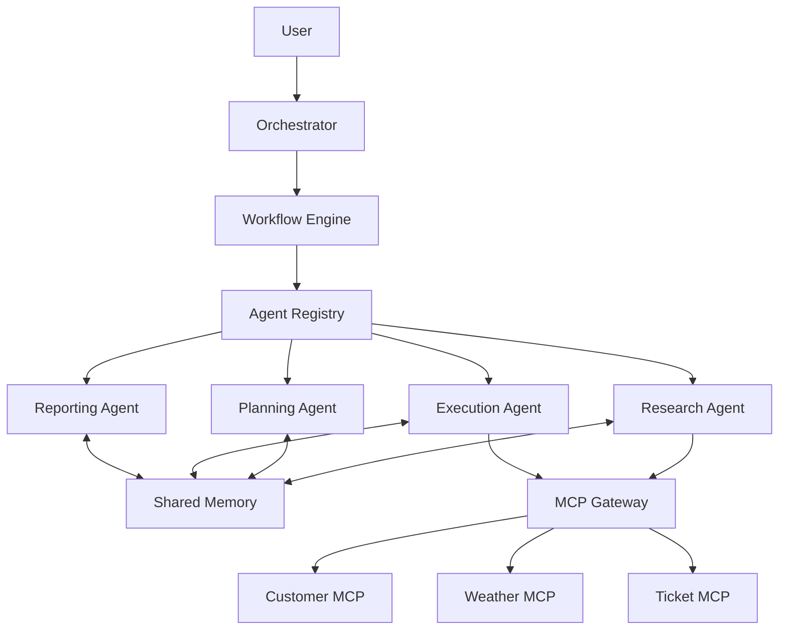
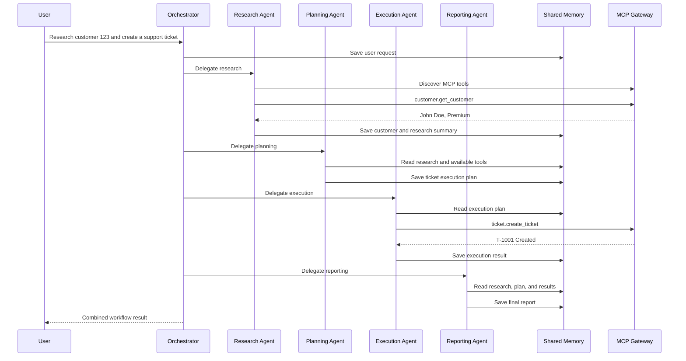
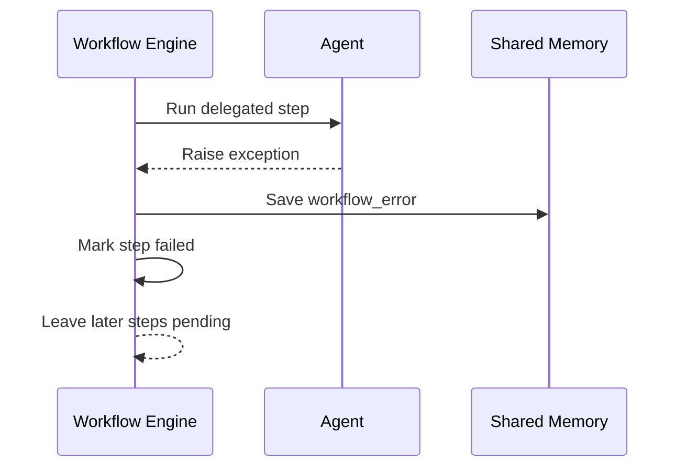

# Phase 8: Multi-Agent MCP Orchestration Platform

Phase 8 evolves the single-agent runtime into a coordinated team of specialist agents.

```text
User
  |
  v
Orchestrator
  |
  +-- Research Agent
  +-- Planning Agent
  +-- Execution Agent
  +-- Reporting Agent
  |
  v
MCP Gateway
  |
  +-- Customer MCP
  +-- Weather MCP
  +-- Ticket MCP
```

This implementation is deterministic and beginner-friendly. It does not require an LLM API. Each agent has one clear responsibility and communicates through typed shared memory.

## Multi-Agent Systems

A multi-agent system contains multiple specialized agents collaborating on one goal.

Instead of one large agent doing everything:

- The Research Agent gathers facts.
- The Planning Agent decides what should happen.
- The Execution Agent performs approved actions.
- The Reporting Agent explains the outcome.
- The Orchestrator delegates the workflow.

Specialization makes responsibilities easier to test, secure, replace, and extend.

## Agent Delegation

Delegation means assigning a workflow step to the agent responsible for it.

The orchestrator delegates this sequence:

```text
research -> planning -> execution -> reporting
```

The workflow engine retrieves each agent from the registry and invokes it.

## Shared Memory

Shared memory is the collaboration workspace.

Agents write and read values such as:

```text
user_request
available_tools
customer
research_summary
execution_plan
execution_results
final_report
workflow_error
```

Memory also records immutable communication events, including:

- Agent started
- Agent completed
- Memory written
- MCP tool executed
- Workflow delegated

## Workflow Orchestration

Workflow orchestration coordinates:

1. Agent order
2. Delegation
3. Shared state
4. Status tracking
5. Failure handling
6. Final output

The engine stops when an agent fails. Later steps remain pending, and the error is stored in shared memory.

## Agent Communication

Agents do not call each other directly.

They communicate by:

1. Writing typed values to shared memory.
2. Publishing communication events.
3. Reading values produced by earlier agents.

This reduces coupling between agents.

## Architecture



## Customer Issue Workflow



## Failure Flow



## Setup

Use Python 3.12 or newer.

```bash
cd /Users/juanitamelosha/Desktop/MCP-build/mcp-poc-python/phase8_multi_agent
python3.12 -m venv .venv
source .venv/bin/activate
python -m pip install -r requirements.txt
```

The platform reuses the Phase 3 customer, weather, and ticket MCP server scripts.

## Run

### Customer Issue Workflow

```bash
python examples/customer_issue_workflow.py
```

Expected workflow statuses:

```text
- research: completed
- planning: completed
- execution: completed
- reporting: completed
```

### Inspect Registry And Shared Memory

```bash
python examples/inspect_shared_memory.py
```

This prints:

- Registered agents
- Shared memory values
- Agent communication events

### Demonstrate Failure Handling

```bash
python examples/failure_handling.py
```

This intentionally uses an empty gateway.

Expected shape:

```text
Workflow failed in research: Unknown MCP server namespace: customer

- research: failed
- planning: pending
- execution: pending
- reporting: pending
```

## Structured Logging

Logs consistently include:

- Timestamp
- Log level
- Logger/agent name
- Workflow step
- Tool name
- Tool arguments
- Success or failure

Example:

```text
INFO phase8.workflow Starting step 1 with research
INFO phase8.research_agent Discovered MCP tools: [...]
INFO phase8.planning_agent Created execution plan: ...
INFO phase8.execution_agent Executing task 1: tool=ticket.create_ticket ...
INFO phase8.reporting_agent Final report created
```

No secrets or credentials are logged.

## Every File

### `gateway.py`

Discovers and routes tools across Customer, Weather, and Ticket MCP servers.

### `agents/agent_registry.py`

Registers specialist agents and retrieves them by name.

### `agents/shared_memory.py`

Stores workflow values and communication events.

### `agents/workflow_engine.py`

Executes delegated agents in order and handles failures.

### `agents/research_agent.py`

Discovers MCP tools and retrieves customer information.

### `agents/planning_agent.py`

Turns research into an executable ticket plan.

### `agents/execution_agent.py`

Executes planned MCP calls through the gateway.

### `agents/reporting_agent.py`

Creates the final combined workflow report.

### `agents/orchestrator.py`

Registers agents and starts the customer-issue workflow.

### `examples/common.py`

Configures logging and creates the orchestrator.

### `examples/customer_issue_workflow.py`

Runs the successful four-agent workflow.

### `examples/inspect_shared_memory.py`

Shows registry contents, memory values, and communication history.

### `examples/failure_handling.py`

Demonstrates controlled workflow failure.

### `requirements.txt`

Installs the official MCP Python SDK.

## Every Class

### `ToolInfo`

Metadata for a dynamically discovered MCP tool.

### `ServerConfig`

Configuration for one local MCP server.

### `MCPGateway`

Discovers and routes namespaced MCP tools.

### `MemoryEvent`

Immutable record of one agent or workflow event.

### `SharedMemory`

Shared values and event history used for agent communication.

### `Agent`

Protocol implemented by every specialist agent.

### `AgentRegistry`

Stores agents by unique name.

### `StepStatus`

Workflow states:

- pending
- running
- completed
- failed

### `WorkflowStep`

Tracks one delegated agent and its status/error.

### `WorkflowResult`

Returns success state, step statuses, and final output.

### `WorkflowEngine`

Delegates agents sequentially and stops on failure.

### `ResearchAgent`

Discovers MCP tools and gathers customer context.

### `ExecutionTask`

Typed MCP action produced by planning.

### `PlanningAgent`

Creates a validated execution plan.

### `ExecutionAgent`

Executes tasks through the MCP Gateway.

### `ReportingAgent`

Creates the user-facing report.

### `Orchestrator`

Builds the agent team and starts workflows.

## Every Important Function

### Gateway

- `register_server()`: registers an MCP server.
- `discover_tools()`: dynamically discovers all tools.
- `call_tool()`: routes a namespaced call.
- `build_gateway()`: registers Phase 3 servers.

### Shared Memory

- `write()`: stores a value and publishes an event.
- `read()`: reads an optional value.
- `require()`: reads a required value.
- `publish()`: records an agent communication event.
- `snapshot()`: copies current workflow values.
- `clear()`: resets memory.

### Registry

- `register()`: registers an agent.
- `remove()`: removes an agent.
- `get()`: retrieves an agent.
- `list_agents()`: lists agent names.

### Workflow Engine

- `execute()`: delegates agents, tracks statuses, and handles errors.

### Research Agent

- `run()`: discovers tools and retrieves customer data.
- `_extract_customer_id()`: extracts the customer id.

### Planning Agent

- `run()`: creates the MCP execution plan.
- `_priority_for_plan()`: maps customer plans to ticket priority.

### Execution Agent

- `run()`: calls each planned MCP tool.

### Reporting Agent

- `run()`: combines workflow artifacts into the final report.

### Orchestrator

- `run_customer_issue_workflow()`: resets memory, delegates the workflow, and returns its result.

## Evolution

### Virtual Project Manager

Add specialist agents for:

- Project health
- Risk detection
- Dependency tracking
- Stakeholder updates
- Jira/Confluence operations

The orchestrator can run scheduled project-review workflows.

### Friday Rewind

A Friday Rewind workflow could delegate:

1. Research Agent gathers Jira, GitHub, Slack, and calendar activity.
2. Planning Agent categorizes achievements, blockers, and next steps.
3. Execution Agent fetches missing details.
4. Reporting Agent creates a weekly summary.

### Sprint Planner

A Sprint Planner could add:

- Backlog Agent
- Capacity Agent
- Dependency Agent
- Estimation Agent
- Sprint Reporting Agent

Shared memory becomes the draft sprint plan.

### Enterprise Agent Platforms

Enterprise platforms add:

- Persistent workflow state
- Human approvals
- Role-based tool access
- Audit logs
- Retries and compensation
- Distributed task queues
- Observability
- GitHub, Rovo, Slack, CRM, and data MCP providers

### Agent Marketplaces

An agent marketplace publishes:

- Agent identity
- Capabilities
- Required tools
- Input/output contracts
- Owner
- Permissions
- Cost and reliability metadata

The registry can evolve from an in-process dictionary into a governed enterprise catalog. The orchestrator can then discover specialist agents dynamically in the same way MCP gateways discover tools.

