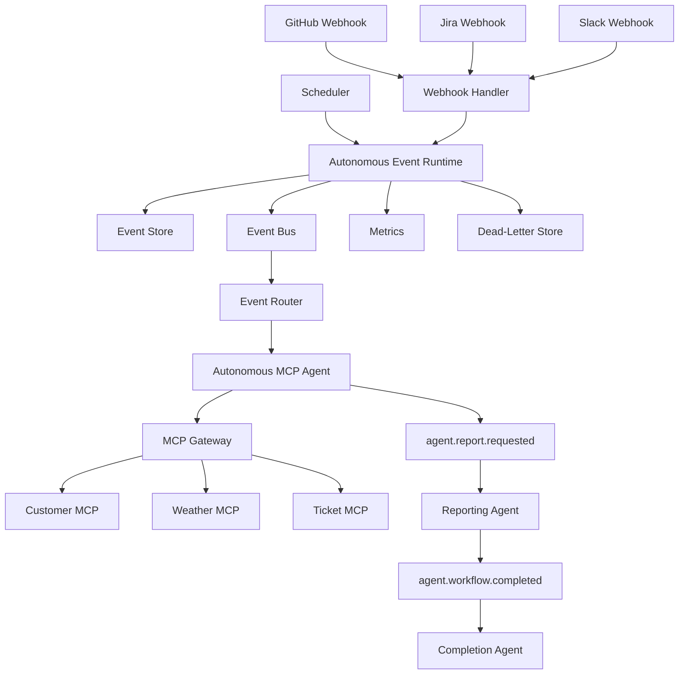
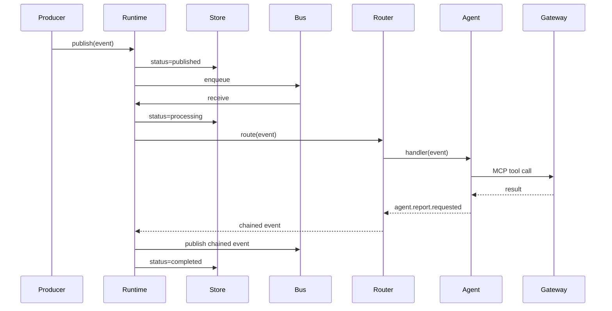
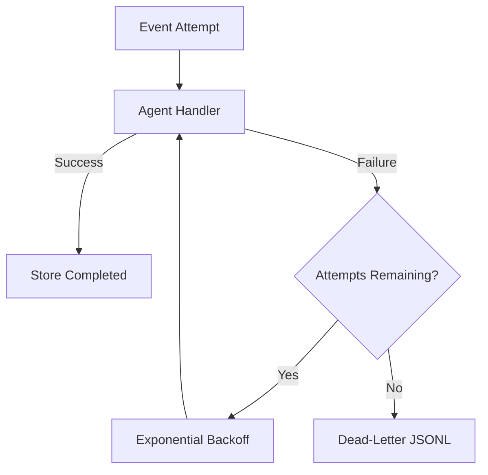

# Phase 9: Event-Driven Autonomous MCP Agents

Phase 9 transforms the multi-agent platform into an autonomous event-driven system.

```text
Events
  |
  v
Event Bus
  |
  v
Event Router
  |
  v
Autonomous Agents
  |
  v
MCP Gateway
  |
  v
External Systems
```

The implementation is local and educational. Webhooks are normalized from sample payloads, schedules use `asyncio`, the event bus is in memory, and event history is persisted as JSONL.

## Event-Driven Architecture

Event-driven architecture reacts to facts that have already happened.

Examples:

```text
github.pr.created
jira.issue.created
jira.issue.updated
slack.message.posted
daily.summary
friday.rewind
```

Producers publish events without needing to know which agent will handle them. The router connects event types to handlers.

## Webhooks

A webhook is an HTTP notification sent by an external system.

The `WebhookHandler`:

1. Receives headers and raw JSON.
2. Verifies GitHub HMAC signatures when configured.
3. Parses provider-specific fields.
4. Converts them into a platform `Event`.
5. Publishes the event through the autonomous runtime.

Mappings:

| Provider Event | Platform Event |
|---|---|
| GitHub pull request opened | `github.pr.created` |
| Jira issue created | `jira.issue.created` |
| Jira issue updated | `jira.issue.updated` |
| Slack message event | `slack.message.posted` |

This phase provides webhook processing logic, not a public HTTP server. A production service would call `WebhookHandler.process()` from FastAPI, Starlette, Flask, or a serverless function.

## Event Routing

The router maintains:

```text
event type -> one or more async handlers
```

External events route to the autonomous MCP agent. Internal events route to reporting and completion agents.

## Scheduled Agents

Scheduled agents publish events without user interaction.

Examples:

- `daily.summary` every morning
- `friday.rewind` every Friday afternoon

The scheduler publishes onto the same runtime path as webhooks, so schedules receive the same storage, metrics, retries, routing, and dead-letter handling.

## Autonomous Agents

An autonomous agent starts because an event arrived, not because a user opened a chat.

In this phase, agents can automatically:

- Create a review ticket for a new GitHub pull request.
- Research a customer for a new Jira issue.
- Check ticket status after a Jira update.
- Turn a Slack support message into a customer lookup and ticket.
- Fetch a daily weather signal.
- Gather customer and ticket status for a Friday rewind.

## Architecture



## Event Lifecycle



## Retry And Dead-Letter Flow



Default retry behavior:

```text
Attempt 1
Wait 0.05 seconds
Attempt 2
Wait 0.10 seconds
Attempt 3
Dead letter
```

## Workflow Chaining

External events produce internal events:

```text
github.pr.created
  -> agent.report.requested
  -> agent.workflow.completed
```

Every child keeps:

- The same correlation id
- Its own event id
- The parent event id as `causation_id`

This makes an event chain traceable.

## Event History And Replay

The store writes append-only JSONL records:

```text
published
processing
retrying
completed
dead_letter
```

Replay creates a new event linked to the stored original. It does not reuse the original event id.

## Metrics

Metrics include:

```text
events_published
events_received
events_completed
event_attempt_failures
event_retries
events_dead_lettered
events_replayed
mcp_tool_calls
```

Per-event and per-tool counters are also recorded:

```text
events_completed.github.pr.created
mcp_tool_calls.ticket.create_ticket
```

## Structured Logging

Logs are emitted as JSON:

```json
{
  "attempt": 1,
  "event_id": "...",
  "event_type": "github.pr.created",
  "level": "INFO",
  "logger": "phase9.runtime",
  "message": "Processing event",
  "timestamp": "..."
}
```

This format can be ingested by Datadog, Splunk, CloudWatch, OpenSearch, Loki, or an enterprise SIEM.

## Setup

Do not use the macOS `python` command before activating the virtual environment.
On this machine it may resolve to the obsolete system Python 2.7.

```bash
cd /Users/juanitamelosha/Desktop/MCP-build/mcp-poc-python/phase9_event_driven
python3.12 -m venv .venv
source .venv/bin/activate
python --version
python -m pip install --upgrade pip setuptools wheel
python -m pip install -r requirements.txt
```

`python --version` must show Python 3.12 or newer.

If a partially installed environment reports a dependency resolution error, recreate
only the Phase 9 environment:

```bash
deactivate 2>/dev/null || true
mv .venv .venv-broken
python3.12 -m venv .venv
source .venv/bin/activate
python -m pip install --upgrade pip setuptools wheel
python -m pip install -r requirements.txt
```

After confirming the new environment works, the `.venv-broken` directory can be
deleted manually.

The platform reuses the Phase 3 customer, weather, and ticket MCP server scripts.

## Run Examples

### All Supported Events

```bash
python examples/autonomous_demo.py
```

This publishes:

- `github.pr.created`
- `jira.issue.created`
- `jira.issue.updated`
- `slack.message.posted`
- `daily.summary`
- `friday.rewind`

All six trigger agents and MCP tools without user interaction.

### Webhook Processing

```bash
python examples/webhook_demo.py
```

Demonstrates GitHub signature validation and pull-request normalization.

### Scheduled Events

```bash
python examples/scheduler_demo.py
```

Publishes `daily.summary` and `friday.rewind` automatically.

### Replay

```bash
python examples/replay_demo.py
```

Processes `daily.summary`, reads it from history, and replays it.

### Retry And Dead Letter

```bash
python examples/dead_letter_demo.py
```

Expected metrics:

```json
{
  "event_attempt_failures": 3,
  "event_retries": 2,
  "events_dead_lettered": 1
}
```

## Supported Event Workflows

| Event | Autonomous MCP Workflow |
|---|---|
| `github.pr.created` | `ticket.create_ticket` |
| `jira.issue.created` | `customer.get_customer` |
| `jira.issue.updated` | `ticket.get_ticket_status` |
| `slack.message.posted` | `customer.get_customer` then `ticket.create_ticket` |
| `daily.summary` | `weather.get_weather` |
| `friday.rewind` | `customer.get_customer` then `ticket.get_ticket_status` |

## Every File

### `events/event_bus.py`

Immutable `Event` model and asynchronous queue.

### `events/event_router.py`

Maps event types to asynchronous handlers.

### `events/event_store.py`

Append-only history, dead letters, and replay selection.

### `events/webhook_handler.py`

Validates and normalizes GitHub, Jira, and Slack webhooks.

### `events/scheduler.py`

Publishes recurring and one-time scheduled events.

### `events/runtime.py`

Autonomous worker, retries, chaining, storage, replay, dead letters, and metrics.

### `events/metrics.py`

In-memory named counters.

### `events/logging_utils.py`

JSON structured logging.

### `agents/event_agents.py`

Autonomous MCP, reporting, and completion agents.

### `gateway.py`

Routes automatic tool calls to Phase 3 MCP servers.

### `autonomous_platform.py`

Builds and connects all components.

### `examples/autonomous_demo.py`

Runs all six required event types.

### `examples/webhook_demo.py`

Demonstrates webhook validation.

### `examples/scheduler_demo.py`

Demonstrates scheduled agents.

### `examples/replay_demo.py`

Demonstrates history replay.

### `examples/dead_letter_demo.py`

Demonstrates retries and dead-letter storage.

## Every Class

### `Event`

Immutable event with type, payload, source, ids, timestamp, correlation, and causation.

### `EventBus`

Async in-memory queue.

### `EventRouter`

Handler registry and routing layer.

### `NoEventHandlerError`

Raised for events without routes.

### `EventRecord`

Persistent lifecycle record.

### `EventStore`

JSONL history, dead letters, and replay.

### `Metrics`

Named runtime counters.

### `WebhookHandler`

Provider payload normalization and signature checking.

### `WebhookValidationError`

Raised for invalid signatures, JSON, or event mappings.

### `Schedule`

Recurring schedule configuration.

### `EventScheduler`

Publishes time-driven events.

### `JsonFormatter`

Formats logs as JSON.

### `AutonomousEventRuntime`

Consumes, routes, retries, chains, stores, and replays events.

### `MCPGateway`

Routes autonomous tool calls.

### `AutonomousMCPAgent`

Handles the six required external event types.

### `ReportingEventAgent`

Creates autonomous workflow reports.

### `CompletionAgent`

Observes workflow completion.

### `EventDrivenPlatform`

Container for all platform components.

## Every Important Function

### Event

- `to_dict()`: serializes an event.
- `from_dict()`: restores an event.
- `child()`: creates a correlated chained event.

### Event Bus

- `publish()`: queues an event.
- `receive()`: waits for an event.
- `task_done()`: completes queue accounting.
- `join()`: waits for idle.
- `pending_count()`: reports queue depth.

### Router

- `register()`: registers a route.
- `remove()`: removes a route.
- `list_routes()`: returns routing metadata.
- `route()`: runs handlers and returns chained events.

### Store

- `record()`: stores event lifecycle status.
- `dead_letter()`: stores exhausted events.
- `history()`: reads history.
- `dead_letters()`: reads dead letters.
- `replayable_events()`: selects unique replay candidates.

### Webhooks

- `process()`: validates, normalizes, and publishes.
- `_normalize()`: maps provider payloads.
- `_verify_github_signature()`: verifies HMAC SHA-256.

### Scheduler

- `schedule()`: starts recurring publication.
- `publish_once()`: publishes after a delay.
- `stop()`: stops one schedule.
- `stop_all()`: stops all schedules.

### Runtime

- `publish()`: records metrics/history and queues an event.
- `run_until_idle()`: processes all event chains.
- `replay()`: republishes stored events.
- `_worker()`: consumes the bus.
- `_process()`: retries, chains, completes, or dead-letters.

### Agents

- `github_pr_created()`: creates a review ticket.
- `jira_issue_created()`: researches a customer.
- `jira_issue_updated()`: checks ticket status.
- `slack_message_posted()`: runs a two-tool workflow.
- `daily_summary()`: gets a daily signal.
- `friday_rewind()`: gathers customer and ticket state.
- `create_report()`: creates a final report event.
- `workflow_completed()`: records completion.
- `register_event_agents()`: wires routes to agents.

## Evolution

### Friday Rewind

Replace sample tools with GitHub, Jira, Slack, calendar, and Confluence MCP providers.

A schedule publishes `friday.rewind`, agents collect the week's activity, and a reporting agent sends a summary automatically.

### Sprint Monitoring

Events:

```text
jira.issue.updated
jira.sprint.started
jira.sprint.completed
github.pr.created
github.check.failed
```

Agents detect scope changes, stalled work, review bottlenecks, and delivery risk.

### Unblocking Agent

The system observes:

- Blocked Jira issues
- Failed builds
- Unanswered Slack questions
- Missing pull-request reviews

It gathers context and creates or assigns follow-up actions.

### DevOps Agents

Events from deployments, alerts, logs, and CI/CD can trigger:

- Incident investigation
- Rollback recommendations
- Runbook execution
- Status-page updates
- Post-incident reports

High-impact tools should require human approval.

### Enterprise AI Operations Platforms

Production evolution adds:

- Kafka, NATS, SQS, Pub/Sub, or EventBridge
- PostgreSQL or durable event stores
- Distributed workers
- Idempotency keys
- Schema registries
- OpenTelemetry traces
- Approval workflows
- Policy engines
- Tenant isolation
- Encrypted secrets
- Retention and compliance controls

The Phase 9 interfaces stay recognizable even when the local queue and JSONL files are replaced by enterprise infrastructure.
